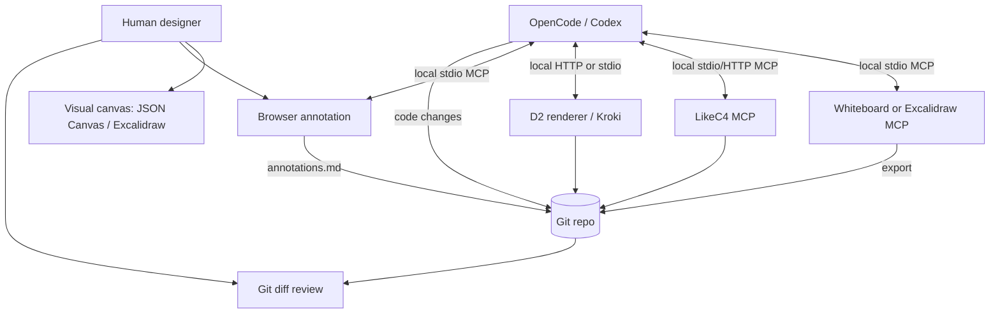

# Self-hosted visual design, diagrams, browser-feedback and creative-coding tools for solo operators + coding agents

**Research snapshot:** 2026-10-09 (Europe/Warsaw)  
**Scope:** strictly open-source software; locally operable or self-hostable; preference for novel, agent-friendly and Git-compatible tools; **§§16–22 add agent-generated interactive UI SDKs**.  
**Method:** primary-source repository, license and deployment-file reviews, supplemented by upstream documentation. **No local deployment or integration tests were executed.**  
**Result:** an original design/code-tool audit and a 2026-10-09 Generative UI addendum covering six SDKs/protocols, verified licenses, deployment approaches, and concrete integration bets.

> **Read this evidence note first.** Live GitHub REST metadata was inaccessible during this research run, and GitHub's HTML repo pages generally do not expose their last-push timestamps to the available reader. The `pushed_at` field is therefore **U (unverified)** for most repositories. A few dated **third-party indexed** last-push observations are explicitly labeled as such; they are not a fresh GitHub API confirmation. Stars are approximate values from fetched pages, when visible, **not maintenance scores**. Neither a README command nor the existence of a Dockerfile proves that the application starts successfully. An actionable GitHub-API command for filling these metadata gaps is provided in §13. Please do not silently convert these gaps into dates or tests.

## 1. Executive decision

The highest-leverage new candidates are **kamiazya/whiteboard** (agent-managed JSON Canvas and Markdown with native MCP and skills), **yctimlin/mcp_excalidraw** (live editable Excalidraw artifacts, a CLI and an agent skill), and **LikeC4** (a source-controlled architecture model with a *native* MCP server). These three deserve attention ahead of another generic web whiteboard. **Doop** is the most intriguing design-to-HTML experiment; **Penpot's integrated MCP service** changes the value of a familiar product; and **annotate-mcp**, **Anno**, **Pointa**, and **React Grab** each represent different ways to turn a visual critique into an agent action. [V/D: linked upstream sources in dossiers below; I: prioritization.]

**Three defaults:** (1) store the master record in files under Git; (2) prefer agent operations that result in reviewable diffs or durable exports; (3) keep hosted accounts, anonymous telemetry, arbitrary code execution and extra stateful services off the critical path. [I]

**Important changes versus the previous overview:** LikeC4 **does** have upstream `@likec4/mcp` and an agent-facing DSL skill; the old `penpot/penpot-mcp` repository was archived on **2026-02-03** and merged into the main `penpot/penpot` repository; and a canvas-first `kamiazya/whiteboard` has a documented Compose server and Markdown/JSON Canvas serialization. Furthermore, **Agentation** and the **Ventus API** do **not** pass the strict open-source license requirement, despite attractive interfaces. [V/D; links in §§3–4 and 9.]

## 2. Audit semantics and hard gates

- **V — Verified source read on 2026-10-09:** repository file contents or license text were fetched and inspected; *does not mean locally run*.
- **D — Documented by upstream on 2026-10-09:** README, docs, commands, user-facing claims, version notes. No local validation.
- **I — Inference:** suitability, expected failure modes, workflow recommendations or proposed artifacts.
- **U — Unverified:** not ascertainable in this session. Never count it as passed.
- **Eligible:** recognized open-source terms **and** self-hostable source. A published Dockerfile, Compose manifest or documented local server counts as deployment evidence, but these are distinguished (`C` = Docker/Compose; `L` = local source process; `E` = embeddable library). A built-in SaaS dependency disqualifies *the use path* even when the adapter itself is MIT.
- **Licenses:** SPDX strings describe the repo's main or named component where the license file is readable. When a GNU license **full-text file alone** does not settle `-only` versus `-or-later` for the code, the exact suffix is noted as unresolved instead of pretending the full text decides it. Component-level exceptions matter: the **Webstudio animation package**, **Rete advanced plugins**, and **stagewise Nucleo icons** should not be treated as covered by the permissive/AGPL core licenses.
- **Decisions:** **KEEP** = worth offering as a standard building block; **TRIAL** = concrete experiment; **WATCH** = credible but either a poor fit or a missing deployment/agent-confidence detail; **REJECT** = fails hard conditions or use-case constraints. A WATCH entry with missing licensing is a research lead, **not approved**.

The repo links, source paths and license links below were visited/read or derived from repository-file locations on **2026-10-09**. Source links in each row let a reader independently repeat the audit.

## 3. Comprehensive decision matrix

Every row has **job / agent bridge / likely failure**, while §4 adds implementation detail and test targets. Dates explicitly marked **index** are lower-confidence third-party observations, not fresh authoritative `pushed_at` fields.

| Tool | Decision | Source and license evidence (SPDX) | Push / stars (context) | Self-host evidence | MCP / skill / code bridge | Best job; local-first failure hypothesis [I] |
|---|---|---|---|---|---|---|
| [kamiazya/whiteboard](https://github.com/kamiazya/whiteboard) | **KEEP** | [LICENSE](https://github.com/kamiazya/whiteboard/blob/main/LICENSE): **Apache-2.0** [V] | Push U; ~10★ [D] | [Dockerfile.server](https://github.com/kamiazya/whiteboard/blob/main/Dockerfile.server), [docker-compose.server.yml](https://github.com/kamiazya/whiteboard/blob/main/docker-compose.server.yml) **C** [V] | `@kamiazya/whiteboard-mcp`, three bundled skills; OKF Markdown and JSON Canvas [D] | Human+agent architecture whiteboard; experimental 0.0.x ecosystem and browser-extension/native-host setup. |
| [yctimlin/mcp_excalidraw](https://github.com/yctimlin/mcp_excalidraw) | **KEEP** | [LICENSE](https://github.com/yctimlin/mcp_excalidraw/blob/main/LICENSE): **MIT** [V] | Push U; ~2.5k★ [D] | [Dockerfile](https://github.com/yctimlin/mcp_excalidraw/blob/main/Dockerfile), [Dockerfile.canvas](https://github.com/yctimlin/mcp_excalidraw/blob/main/Dockerfile.canvas), [docker-compose.yml](https://github.com/yctimlin/mcp_excalidraw/blob/main/docker-compose.yml) **C** [V] | MCP, CLI (`npx -y mcp-excalidraw-server`), `skills/excalidraw-skill` [D] | Editable wireflows/flows; live state and export must be synchronized, layout can be ugly. |
| [kgoedecke/doop](https://github.com/kgoedecke/doop) | **TRIAL** | [LICENSE](https://github.com/kgoedecke/doop/blob/main/LICENSE): **AGPL-3.0**, exact suffix verify against repo notice [V] | Push U; ~821★ from prior snapshot [D; stale] | [docker-compose.yml](https://github.com/kgoedecke/doop/blob/main/docker-compose.yml), [Dockerfile](https://github.com/kgoedecke/doop/blob/main/Dockerfile) **C** [V/D] | Built-in MCP, agent live frame editing [D] | HTML design explorations; output may not be durable app code; database/auth overhead. |
| [rodacato/drawhaus](https://github.com/rodacato/drawhaus) | **TRIAL** | [LICENSE.md](https://github.com/rodacato/drawhaus/blob/master/LICENSE.md): **MIT** [V] | Push U; ~5★ [D; indicative] | [docker-compose.yml](https://github.com/rodacato/drawhaus/blob/master/docker-compose.yml) **C** [V] | MCP + REST + diagram-as-code documented [D] | Excalidraw-like collaboration; very young/limited adoption and several services. |
| [open-pencil/open-pencil](https://github.com/open-pencil/open-pencil) | **TRIAL** | [LICENSE](https://github.com/open-pencil/open-pencil/blob/master/LICENSE): **MIT** [V] | Push U; ~8.8k★ [D; indicative] | local editor (`bun run dev`), desktop app, [package.json](https://github.com/open-pencil/open-pencil/blob/master/package.json); full Compose **U** (**L**) [D/V] | `@open-pencil/mcp`, `openpencil-mcp-http`, skill [D] | Agent-editable screen hierarchy; pixel/constraint fidelity and import-export loss. |
| [penpot/penpot](https://github.com/penpot/penpot) | **TRIAL** | [LICENSE](https://github.com/penpot/penpot/blob/develop/LICENSE): **MPL-2.0** [V/D] | Push U; stars U | [docker/images/docker-compose.yaml](https://github.com/penpot/penpot/blob/develop/docker/images/docker-compose.yaml), [Dockerfile.mcp](https://github.com/penpot/penpot/blob/develop/docker/images/Dockerfile.mcp) **C** [V] | Official MCP integrated in `mcp/` with plugin bridge [D] | Proper reusable design documents; heavy stack and MCP/plugin connection semantics. |
| [needmorecowbell/drawfinity](https://github.com/needmorecowbell/drawfinity) | **WATCH** | [LICENSE](https://github.com/needmorecowbell/drawfinity/blob/main/LICENSE): **MIT** [V] | Push U; stars U | [docker-compose.yml](https://github.com/needmorecowbell/drawfinity/blob/main/docker-compose.yml), `Dockerfile.frontend` **C** [V/D] | Lua turtle graphics; native MCP **U** [D] | Procedural visuals; weak direct UI-production link. |
| [spacedeck/spacedeck-open](https://github.com/spacedeck/spacedeck-open) | **WATCH** | [LICENSE](https://github.com/spacedeck/spacedeck-open/blob/mnt/LICENSE): **AGPL-3.0-or-later** per upstream grant [D/V] | Push U; ~1.1k★ [D] | [docker-compose.yml](https://github.com/spacedeck/spacedeck-open/blob/mnt/docker-compose.yml) **C** [V/D] | No upstream native MCP established [U] | Rich-media spatial moodboards; older architecture, redundant for solo agent workflows. |
| [nextcloud/whiteboard](https://github.com/nextcloud/whiteboard) | **WATCH** | [license/SPDX headers](https://github.com/nextcloud/whiteboard/blob/main/docker-compose.yml): **AGPL-3.0-or-later** [V] | Push U; stars U | [docker-compose.yml](https://github.com/nextcloud/whiteboard/blob/main/docker-compose.yml) **C** [V] | No native MCP established [U] | Whiteboard inside Nextcloud; Nextcloud itself becomes a mandatory dependency. |
| [devdotfast/whiteboard](https://github.com/devdotfast/whiteboard) | **TRIAL** | [LICENSE](https://github.com/devdotfast/whiteboard/blob/main/LICENSE): **MIT** [V] | Push U; ~66 GH-Archive stars-events **not total** [D] | Local desktop app/Code-OSS fork; Docker **U** (**L**) [D] | Visual code-review interface, not a traditional drawing canvas [D] | Review agent diffs with spatial/contextual UI; giant vendored editor and privacy/telemetry audit. |
| [webstudio-is/webstudio](https://github.com/webstudio-is/webstudio) | **WATCH** | [LICENSE](https://github.com/webstudio-is/webstudio/blob/main/LICENSE): **AGPL-3.0-or-later** core; proprietary optional animation component [V/D] | Push U; ~9k★ [D] | [community self-host Compose](https://github.com/webstudio-community/webstudio-self-host/blob/main/docker-compose.yml) **C, community** [D] | No upstream first-party MCP verified [U] | Visual websites/CSS; builder publish stack and optional proprietary pieces. |
| [GrapesJS/grapesjs](https://github.com/GrapesJS/grapesjs) | **WATCH** | [packages/core/LICENSE](https://github.com/GrapesJS/grapesjs/blob/dev/packages/core/LICENSE): **BSD-3-Clause** [V] | Push U; stars U | Embeddable editor, no core Docker deployment verified **E** [D] | Source HTML/JSON APIs; native MCP **U** | Build a custom local page editor; must own saving, security, plugins and rendering. |
| [retejs/rete](https://github.com/retejs/rete) | **WATCH** | [LICENSE](https://github.com/retejs/rete/blob/main/LICENSE): **MIT** core [V]; [licensing docs](https://retejs.org/docs/licensing/) note noncommercial advanced plugins [D] | Push U; ~12.3k★ [D] | Embeddable JS graph library, no app Compose **E** [D] | No native MCP established [U]; JSON graph editable by agent | A custom workflow-graph editor; it is a framework, not a turnkey self-host service. |
| [likec4/likec4](https://github.com/likec4/likec4) | **KEEP** | [LICENSE](https://github.com/likec4/likec4/blob/main/LICENSE), [packages/mcp/LICENSE](https://github.com/likec4/likec4/blob/main/packages/mcp/LICENSE): **MIT** [V] | Push U; stars U | [Dockerfile](https://github.com/likec4/likec4/blob/main/Dockerfile) **C**, `npx likec4 start` **L** [V/D] | `@likec4/mcp`, `likec4 mcp`, agent DSL skill [D] | Canonical architecture model with views; too formal for loose journey mapping. |
| [structurizr/structurizr](https://github.com/structurizr/structurizr) | **KEEP** | [repo LICENSE](https://github.com/structurizr/structurizr/blob/main/LICENSE): **Apache-2.0** [D/V] | Push U; ~424★ older source snapshot [D] | [local Docker docs](https://docs.structurizr.com/local) **C** [D] | [official MCP](https://docs.structurizr.com/ai/mcp) [D] | Strict C4 diagrams; heavy DSL and precision may impede ideation. |
| [h0rv/d2-mcp](https://github.com/h0rv/d2-mcp) | **TRIAL** | [LICENSE](https://github.com/h0rv/d2-mcp/blob/main/LICENSE): **MIT** [V] | Push U; ~19★ [D] | `ghcr.io/h0rv/d2-mcp:main` **C** [D] | MCP compile/render/check, HTTP/stdin [D] | Quick `*.d2` flow and screenshot; renderer only, not visual co-editing. |
| [terrastruct/d2](https://github.com/terrastruct/d2) | **KEEP** | [LICENSE.txt](https://github.com/terrastruct/d2/blob/master/LICENSE.txt): **MPL-2.0** [D] | Push U; stars U | Local CLI / official image documented; Docker manifest path **U** (**L**) [D] | Direct source editing, D2 language; d2-mcp above adds MCP | Git-owned flow/state diagrams; layout semantics differ from visual expectations. |
| [mermaid-js/mermaid-live-editor](https://github.com/mermaid-js/mermaid-live-editor) | **KEEP** | [LICENSE](https://github.com/mermaid-js/mermaid-live-editor/blob/develop/LICENSE): **MIT** [V] | **2026-09-19 index**, ~6.8k★ [D, third party] | [Dockerfile](https://github.com/mermaid-js/mermaid-live-editor/blob/develop/Dockerfile) **C** [V] | Mermaid textual diagrams; no editor-native MCP verified [U] | Broad portable diagrams; default remote render URLs need careful build configuration. |
| [yuzutech/kroki](https://github.com/yuzutech/kroki) | **KEEP** | [LICENSE](https://github.com/yuzutech/kroki/blob/main/LICENSE): **MIT** [V] | Push U; stars U | Upstream container images + [docs](https://docs.kroki.io/kroki/setup/install/) **C** [D] | Render service for many DSLs; optional third-party MCP adapter [D] | One local diagram renderer; large dependency surface, per-format rendering variability. |
| [anatoly-lab/drawdb-mcp](https://github.com/anatoly-lab/drawdb-mcp) | **TRIAL** | [LICENSE](https://github.com/anatoly-lab/drawdb-mcp/blob/main/LICENSE): **AGPL-3.0** (suffix U) [V/D] | Push U; ~27★ [D] | [README Docker run](https://github.com/anatoly-lab/drawdb-mcp#readme) **C** [D] | Built-in MCP; SQL/DBML import-export [D] | Agent-editable ERD; fork risk, backend-owned state/persistence. |
| [drawdb-io/drawdb](https://github.com/drawdb-io/drawdb) | **TRIAL** | [LICENSE](https://github.com/drawdb-io/drawdb/blob/main/LICENSE): **AGPL-3.0** (suffix U) [V] | Push U; ~39.8k★ [D] | Local web app/self-host docs in [README](https://github.com/drawdb-io/drawdb); Docker path **U** [D] | Official [drawdb-mcp](https://github.com/drawdb-io/drawdb-mcp) is **cloud API-key dependent** [D] | Visual schemas without an agent; do not conflate cloud adapter with offline MCP. |
| [chartdb/chartdb](https://github.com/chartdb/chartdb) | **TRIAL** | [LICENSE](https://github.com/chartdb/chartdb/blob/main/LICENSE): **AGPL-3.0** (suffix U) [V] | Push U; ~22.9k★ [D] | Local web application; Docker path **U** [D] | SQL-derived JSON import; no first-party offline MCP verified [U] | Reverse-engineer real schemas; manual SQL query flow, editing/persistence friction. |
| [penrose/penrose](https://github.com/penrose/penrose) | **WATCH** | [LICENSE](https://github.com/penrose/penrose/blob/main/LICENSE): **MIT** [V] | Push U; ~8k★ [D] | Locally runnable web/packages; Compose **U** (**L**) [D] | Direct Domain/Substance/Style text; native MCP **U** | Constraint-solved explanatory diagrams; steep DSL / limited direct UI use. |
| [node-red/node-red](https://github.com/node-red/node-red) | **WATCH** | [LICENSE](https://github.com/node-red/node-red/blob/main/LICENSE): **Apache-2.0** [V] | Push U; stars U | [node-red-docker](https://github.com/node-red/node-red-docker) **C** [V/D] | JSON flows, extensible packages; official general-purpose MCP **U** | Flow-based automation / prototypes; another automation runtime and stateful palette. |
| [motion-canvas/motion-canvas](https://github.com/motion-canvas/motion-canvas) | **WATCH** | [LICENSE](https://github.com/motion-canvas/motion-canvas/blob/main/LICENSE): **MIT** [V] | **2026-07-02 index**, ~19.2k★ [D, third party] | Local Vite/Node development, container Compose **U** (**L**) [D] | TypeScript scene files agent-editable; native MCP **U** | Animated explainer diagrams and demos; media/export pipeline burden. |
| [processing/p5.js-web-editor](https://github.com/processing/p5.js-web-editor) | **TRIAL** | [LICENSE](https://github.com/processing/p5.js-web-editor/blob/develop/LICENSE): **LGPL-2.1** (suffix U) [V/D] | Push U; ~1.7k★ [D] | [Dockerfile](https://github.com/processing/p5.js-web-editor/blob/develop/Dockerfile), [docker-compose.yml](https://github.com/processing/p5.js-web-editor/blob/develop/docker-compose.yml) **C** [V] | Plain JS sketches are agent-editable; no native MCP established [U] | Generative art/light creative-coding IDE; whole editor is a large Node/database deployment. |
| [ElaineMHr/annotate-mcp](https://github.com/ElaineMHr/annotate-mcp) | **KEEP** | [LICENSE](https://github.com/ElaineMHr/annotate-mcp/blob/main/LICENSE): **MIT** [V] | Push U; 0★ indexed snapshot [D] | `npm install`, `node dist/index.js`; **Docker absent in reviewed tree** (**L**) [D] | Playwright-injected overlay; `annotate_*` MCP tools [D] | Inspect a live app and return DOM-anchored feedback; selector drift, one browser, iframe limits. |
| [AmElmo/pointa](https://github.com/AmElmo/pointa) | **TRIAL** | [LICENSE](https://github.com/AmElmo/pointa/blob/main/LICENSE): **MIT** [V] | Push U; stars U | Local `npx -y pointa-server`; no app Docker verified (**L**) [D] | Chromium extension + MCP annotations [D] | Fast repeated localhost UI reviews; extension installation and compatibility. |
| [ojasviyadav/html-portal](https://github.com/ojasviyadav/html-portal) | **TRIAL** | [LICENSE](https://github.com/ojasviyadav/html-portal/blob/main/LICENSE): **MIT** [V] | Push U; stars U | Clone-and-run local MCP/browser viewer; Compose U (**L**) [D] | HTML render + scroll-anchored comments -> MCP [D] | Review plans/prototypes and agent-generated HTML; not full app QA. |
| [philmingdao/anno](https://github.com/philmingdao/anno) | **TRIAL** | [LICENSE](https://github.com/philmingdao/anno/blob/main/LICENSE): **MIT** [V] | Push U; ~1★ [D] | Local Node 22+, server binds `127.0.0.1`; Docker U (**L**) [D] | MCP + host-neutral skill + plugin manifests [D] | Direct edit and annotate static HTML; only isolated preview, little maturity evidence. |
| [aidenybai/react-grab](https://github.com/aidenybai/react-grab) | **KEEP** | [LICENSE](https://github.com/aidenybai/react-grab/blob/main/LICENSE): **MIT** [V] | Push U; ~7.6k★ [D] | Embedded in self-hosted dev app (`npx grab@latest init`); no standalone Docker (**E**) [D] | File/line/component metadata; agent skill in `skills/react-grab` [D] | Point from rendered UI to exact source; React-first, not persistence/annotation workflow. |

### How to interpret the table

A Docker manifest **only establishes reproducible deployment intent**, not correctness. `L` and `E` candidates are still self-hostable in the ordinary sense (run the server or app locally, or embed the library into a local app); however, **they have not satisfied a stricter, container-only procurement rule**. If you personally require an *upstream Compose file for every tool*, filter the list to `C` before scheduling trials. Likewise, the table distinguishes a product's open-source editor from an unrelated cloud API adapter. [I]

## 4. Expanded technical dossiers

### 4.1 Agent-native canvases and live design

#### kamiazya/whiteboard — highest-interest overlooked candidate
**[V]** The root repository contains `Dockerfile.server`, `docker-compose.server.yml`, `LICENSE` and Codex/Claude plugin manifests. [License](https://github.com/kamiazya/whiteboard/blob/main/LICENSE). **[D]** The README documents `@kamiazya/whiteboard-mcp` with stdio transport, a local daemon under `~/.whiteboard/`, export to **OKF Markdown and JSON Canvas 1.0**, and three agent skills (`drawing-visuals`, `coauthoring-visuals`, `auditing-workspaces`). [Repo README](https://github.com/kamiazya/whiteboard). **[D]** A visible version is `mcp-server-v0.0.20` on 2026-09-27, from a [release index](https://mcptoplist.com/server/glama%2Fkamiazya%2Fwhiteboard); this is **not a verified latest version**. **[D]** The MCP smoke instruction includes `wb_workspace_edit({workspaceId:'default',ops:[{op:'document.create',path:'smoke',kind:'spatial'}]})`. **[I]** Excellent match for flow mapping where both human and coding agent can modify the same durable diagram. **[I]** Trial risk: document identity and edit races, early releases, manual extension installation, and the native messaging host. **First file:** `design/flows/onboarding.canvas` plus checked-in `design/flows/onboarding.md` if the same model can round-trip. **Acceptance:** new/edit/export/import across restart and Git diff.

#### yctimlin/mcp_excalidraw — editable freeform diagram files
**[V]** `Dockerfile`, `Dockerfile.canvas`, `docker-compose.yml`, `LICENSE`, and `skills/excalidraw-skill` are present. **[D]** Upstream describes CLI, **26 MCP tools**, REST API, rendered snapshots and `.excalidraw` export. The CLI route is `npx -y mcp-excalidraw-server <command>`; the README describes Node ≥20 and no account/API key. [README](https://github.com/yctimlin/mcp_excalidraw/blob/main/README.md). **[V]** The Docker MCP image runs stdio and explicitly avoids starting the canvas within the backend container; the frontend has a separate image/service. [Dockerfile](https://github.com/yctimlin/mcp_excalidraw/blob/main/Dockerfile). **[I]** Use for screen-to-screen routes, notes, and microinteraction sequences; expect human refinement for positioning and text. **First artifact:** `docs/flows/funding.excalidraw`. **Acceptance:** render screenshot; agent moves a node; exported file has a readable, stable diff; restore into a fresh canvas.

#### Doop — HTML frames on a multiplayer canvas
**[V]** AGPL license and Docker/Compose sources. **[D]** `docker compose up` and `bun run dev` are the upstream primary paths; developer mode uses embedded Postgres/PGlite and production Compose includes a database. Agents operate frame HTML over built-in MCP, with browser edits visible live. [README](https://github.com/kgoedecke/doop). **[D]** Built-in agent features may use external model keys or subscription integrations; do not assume a free or fully offline model backend. **[I]** The payoff is design/implementation adjacency, not guaranteed production code. **First artifact:** `design/prototypes/settings-variants.html`, with CSS and accessibility audit. **Acceptance:** move from canvas to native app/web implementation without losing typography/layout semantics. **Reject condition:** database-managed markup cannot be exported/reconstructed repeatably.

#### Drawhaus — collaboration plus API/MCP
**[V]** MIT in `LICENSE.md`, Compose in repo. **[D]** README describes Excalidraw-based editing, collaboration, REST API, MCP and diagram-as-code. [README](https://github.com/rodacato/drawhaus), [Getting started](https://github.com/rodacato/drawhaus/blob/master/GETTING_STARTED.md). **[I]** Best where you value direct-manipulation over strict Git source. **First artifact:** `design/workshops/component-state-map.excalidraw` or the documented native export. **Risk:** too much auth/backend state for one person and tiny community. **Acceptance:** programmatically add, relocate and remove elements; export; delete server and restore persisted data.

#### OpenPencil — editable design hierarchy, agent operations
**[V]** Root `package.json` snapshot declares `version: 0.15.1` and `license: MIT`; packages include `core`, `scene-graph`, `dom-css`, `mcp`, `cli`, `harness` and others. [package.json](https://github.com/open-pencil/open-pencil/blob/master/package.json). **[D]** Upstream documents `@open-pencil/mcp`, headless editing, `openpencil-mcp-http` and `npx skills add open-pencil/open-pencil`. [README](https://github.com/open-pencil/open-pencil/blob/master/README.md). **[I]** A compelling test for design-token-informed editable mockups. **Risk:** `.fig` and application-specific constraints/components may not round-trip faithfully; full editor Docker proof is unavailable. **First artifact:** `design/settings-exploration` in its native documented file format, plus `design/settings-export.svg`. **Acceptance:** import/edit/export hierarchy, component-instance behavior, fonts, token mapping, then code conversion.

#### Penpot with first-party MCP — familiar tool, materially new integration
**[V]** The modern repo's `docker/images/docker-compose.yaml` includes a `penpot-mcp` service and `PENPOT_FLAGS: ... enable-mcp`; the MCP image is defined in `docker/images/Dockerfile.mcp`. [Compose](https://github.com/penpot/penpot/blob/develop/docker/images/docker-compose.yaml); [Dockerfile.mcp](https://github.com/penpot/penpot/blob/develop/docker/images/Dockerfile.mcp). **[D]** The **standalone official MCP repo was archived 2026-02-03**, and source was integrated into main `penpot/penpot/mcp`. [archived upstream](https://github.com/penpot/penpot-mcp). **[D]** Official MCP docs describe local HTTP and remote MCP connection, access-token handling and connecting an open Penpot file. [docs/mcp/index.md](https://github.com/penpot/penpot/blob/develop/docs/mcp/index.md). **[D]** Compose examples expose image tag `${PENPOT_VERSION:-2.18}`; this is not a live latest-release assertion. **[I]** Strongest choice for real token/component work, weaker for minimal operational overhead. **First artifact:** `design-system/mobile-controls` plus exported component-spec JSON/SVG. **Acceptance:** use agent to update several selected components without changing unrelated styles; recover state from backup. **Risk:** server + exporter + database + cache + WebSocket/plugin bridge, and arbitrary code operations inside design plugin.

#### Drawfinity and Spacedeck / Nextcloud Whiteboard — unconventional but lower priority
**[V/D]** [Drawfinity](https://github.com/needmorecowbell/drawfinity) ships MIT license, `docker-compose.yml` and `Dockerfile.frontend`, with Lua turtle-graphics and Yjs collaborative drawing; useful for procedural visual investigations, not a proven MCP surface. **[D]** [Spacedeck Open](https://github.com/spacedeck/spacedeck-open) has Compose, rich media and AGPLv3; code dates back to an older product lifecycle. **[V]** [Nextcloud Whiteboard](https://github.com/nextcloud/whiteboard/blob/main/docker-compose.yml) provides a server with Nextcloud URL and JWT configuration, but assumes a wider Nextcloud stack. **[I]** Trial only when a specific media/hosting feature is needed; otherwise prioritize the JSON Canvas, Excalidraw or HTML export approaches.

### 4.2 Visual implementation and node-based editors

#### Webstudio — real visual CSS; self-hosting must be tested end-to-end
**[V/D]** The builder core is under **AGPL-3.0-or-later**; the optional `sdk-components-animation` package has proprietary terms explicitly called out by [README](https://github.com/webstudio-is/webstudio/blob/main/README.md) and its own license. **[D]** A [community Compose](https://github.com/webstudio-community/webstudio-self-host) uses builder, PostgreSQL, PostgREST, MinIO, Nginx and a publisher. Upstream previously acknowledged incomplete all-in-one builder self-hosting; [issue #3966](https://github.com/webstudio-is/webstudio/issues/3966) tracks improvement, while separate [Docker export docs](https://github.com/webstudio-is/webstudio-community/blob/main/docs/university/self-hosting/vps-with-docker.md) specifically concern a **published project**, not necessarily the builder. **[I]** Relevant to visual website authoring, but not a lightweight agent scratchpad. **First artifact:** `site/landing` built into a Docker target and checked into a repository. **Reject condition:** builder publish requires an unexpected hosted or closed component.

#### GrapesJS and Rete.js — libraries to build *your own* agent workspace
**[V]** [GrapesJS core](https://github.com/GrapesJS/grapesjs/blob/dev/packages/core/LICENSE) is BSD-3-Clause, while [Rete.js core](https://github.com/retejs/rete/blob/main/LICENSE) is MIT. **[D]** GrapesJS offers blocks/pages/HTML-ish visual editing; Rete offers typed graph nodes and processing flow. **[D]** Rete licensing documentation flags some advanced plugins as **CC-BY-NC-SA-4.0**, so a blanket statement that the entire Rete ecosystem is commercially open-source is false. [Rete licensing](https://retejs.org/docs/licensing/). **[I]** These are *frameworks*, not evidence of a ready-to-run self-host app. They become interesting if you want an agent-specific interactive graph for orchestration roles, prompt recipes or UI states and are comfortable owning serialization and frontend infrastructure. **First artifact:** `agents/graphs/orchestration.json` rendered with a small Rete app. **Acceptance:** UI ↔ JSON round-trip with schema validation and Git diffs.

#### devdotfast/whiteboard — code-review-focused editor fork
**[V/D]** [Repository](https://github.com/devdotfast/whiteboard) is MIT and contains a large vendored Code-OSS-based review desktop application. Despite the name, it is **not** a freeform sketchboard. **[D]** Its design centers on understanding and reviewing agent-produced code changes against local checkouts. **[I]** The genuinely novel angle is a dedicated *review* surface once agents perform most editing, but installation footprint, telemetry and Code-OSS vendor maintenance deserve a stringent audit. **First artifact:** a reviewed PR/patch for `docs/diagrams/agent-routing.d2`, not a separate drawing. **Acceptance:** no cloud account needed; clear accepted/rejected hunks; verifiable local policy for telemetry.

### 4.3 Diagrams-as-code, architecture, and data modeling

#### LikeC4 — better than a mere previewer because MCP is upstream
**[V]** MIT in root and `packages/mcp/LICENSE`; root has a Dockerfile. **[D]** `npx likec4 start` previews a source-controlled model. Native `likec4 mcp` can run stdio or streamable HTTP; `@likec4/mcp` provides a separate slim server that reads `LIKEC4_WORKSPACE`. [MCP README](https://github.com/likec4/likec4/blob/main/packages/mcp/README.md); [AI tooling docs](https://github.com/likec4/likec4/blob/main/apps/docs/src/content/docs/tooling/ai-tools.mdx). **[D]** The repo also exposes `skills/likec4-dsl`, and changelog 1.55.0 records extraction of `@likec4/mcp` (versioned historical evidence, not a live current-version claim). [Changelog](https://github.com/likec4/likec4/blob/main/packages/likec4/CHANGELOG.md). **[I]** First choice for your actual self-hosted services and agent/tool boundaries. **First artifact:** `docs/architecture/workspace.c4` and generated static view. **Acceptance:** agent inspects relations and updates a view, while deleting/recreating the viewer has no effect on source.

#### Structurizr — precise, conservative C4
**[D]** The upstream [local deployment docs](https://docs.structurizr.com/local) describe `structurizr/structurizr local`, and [MCP docs](https://docs.structurizr.com/ai/mcp) document agent validation/export features. **[V/D]** Apache-2.0 core. **[I]** Better than LikeC4 if strict C4 conformity, detailed software-system modeling and review discipline outrank speed. **First artifact:** `docs/architecture/workspace.dsl`; test inclusion, identifiers, renderer, deployment viewpoints. **Failure mode:** visual flow maps become needlessly formal.

#### D2 + d2-mcp — useful tiny graph toolchain
**[D]** D2's text language (`*.d2`) is MPL-2.0; [d2-mcp](https://github.com/h0rv/d2-mcp) provides an MIT MCP service and container image `ghcr.io/h0rv/d2-mcp:main`. It can compile/render SVG, PNG and ASCII through HTTP/stdio and return language guidance. **[I]** Excellent for portable lifecycle diagrams, edge-case trees, service dependencies and UI state maps. **First artifact:** `docs/diagrams/funding-states.d2`, SVG regenerated in CI. **Acceptance:** source remains canonical; output isn't accidentally checked in as sole source; no external renderer. **Risk:** generated layout can be correct but unhelpful; rendering alone does not resolve semantic omissions.

#### Mermaid Live Editor and Kroki — renderer infrastructure
**[V/D]** [Mermaid Live Editor](https://github.com/mermaid-js/mermaid-live-editor/blob/develop/README.md) is MIT and can run in Docker; development Compose and published GHCR image are documented. The README explicitly says build arguments for `MERMAID_RENDERER_URL` and `MERMAID_KROKI_RENDERER_URL` default to public services unless configured/disabled. **[I]** An ostensibly self-hosted frontend can therefore still send diagram source to third parties if left at default build-time URLs. **[V/D]** [Kroki](https://github.com/yuzutech/kroki) is MIT; its local server wraps multiple renderers, with [installation docs](https://docs.kroki.io/kroki/setup/install/). **[I]** For many distinct diagram DSLs, one local Kroki service may be a more useful primitive than multiple overlapping web editors. **First artifact:** `docs/diagrams/render-smoke.md` exercising D2, Mermaid, PlantUML and Graphviz. **Acceptance:** packet inspection / configuration review shows no public fallback; the same source yields reproducible SVG offline.

#### DrawDB, drawdb-mcp, ChartDB — three different schema roles
**[V/D]** [DrawDB](https://github.com/drawdb-io/drawdb) is an AGPL visual ERD application. The **official** [drawDB MCP adapter](https://github.com/drawdb-io/drawdb-mcp) is MIT but explicitly requires a `ddb_` API key for the service's diagram endpoint: it should **not** be sold as an offline bridge. **[D]** The independent [anatoly-lab/drawdb-mcp](https://github.com/anatoly-lab/drawdb-mcp) fork offers a self-hosted Dockerized editor plus MCP server and SQL/DBML imports. **[V/D]** [ChartDB](https://github.com/chartdb/chartdb) is AGPL and is especially interesting for making an existing DB schema visible after a generated SQL/JSON query; exact Docker deployment was not independently confirmed here. **[I]** Choose one primary ERD tool, not all three. **First artifact:** `db/schema.dbml` *or* `db/schema.sql`, generated and re-imported in the chosen viewer. **Acceptance:** server rebuild preserves relational structure and version-controlled export.

#### Penrose — unconventional, mathematical diagram language
**[V]** The repo's `LICENSE` is MIT. **[D]** [Penrose](https://github.com/penrose/penrose) describes diagrams using Domain, Substance and Style files, with constraint-based layout rather than manually drawing every relationship. **[I]** Especially interesting for visualizing intersecting sets, taxonomies, probability, geometry or abstract system constraints. **First artifact:** `experiments/penrose/token-hierarchy.substance` with companion `.domain` and `.style`. **Risk:** DSL and layout solver complexity dwarf value for ordinary product UX; no Docker Compose audited.

#### Node-RED — a different kind of visual code
**[V]** Core Apache-2.0; [official Docker project](https://github.com/node-red/node-red-docker) documents image tags, `/data` persistence, ports, and Compose examples. **[I]** Treat it as a low-code *runtime* for webhook and local event orchestration, not as a diagramming authority. JSON flows can be committed but node versions, secrets and instance storage introduce drift. **First artifact:** `automation/flows.json` for local screenshot/diagram regeneration. **Reject condition:** the automation adds more operational weight than a cron/task runner.

### 4.4 Browser annotation and human-in-the-loop review

#### annotate-mcp — no app instrumentation needed
**[V]** MIT in source file; no published Compose found in reviewed root. **[D]** Playwright's `addInitScript` injects the overlay; `exposeBinding` returns the annotation to Node. Source mentions `ANNOTATE_DIR`, writes `.annotations/store.json`, `annotations.md`, `inbox.md`, and exposes `annotate_open`, `annotate_wait`, `annotate_list`, `annotate_screenshot`, `annotate_resolve` and more. [README](https://github.com/ElaineMHr/annotate-mcp). **[D]** The README itself lists iframe exclusion, imprecise selector reanchoring and human-controlled browser operation as limits. **[I]** Most direct single-user feedback loop without modifying production code. **First artifact:** `.annotations/annotations.md` tied to a commit/viewport. **Acceptance:** annotate element → agent reads mark → fixes code → mark resolved after reload, with no copied screenshots.

#### Pointa — extension-based fast capture
**[V]** MIT file. **[D]** `npx -y pointa-server` starts the local MCP server and HTTP daemon, while an extension selects elements and captures related metadata. [README](https://github.com/AmElmo/pointa). **[I]** Compare against annotate-mcp based on ergonomics, not stars. **First artifact:** a JSON or Markdown export of five component issues (confirm native persistence before assuming the schema). **Risk:** Chromium requirement, extension permissions and possible selector drift. **Acceptance:** resolve five annotations across route changes without manual element IDs.

#### html-portal and Anno — HTML as a review artifact
**[V]** Both projects have MIT license files. **[D]** [html-portal](https://github.com/ojasviyadav/html-portal) renders agent-provided HTML with scroll-attached feedback and sends a batch through MCP; it is clone-and-run and has no published package daemon. **[D]** [Anno](https://github.com/philmingdao/anno) runs a local HTTP editor on `127.0.0.1`, offers direct text, typography and area edits, with durable agent handoffs and host-neutral skills. **[I]** They address review of **static proposals, specs, HTML slides and prototypes**, not faithful stateful QA of a live authenticated app. **First artifact:** `reviews/component-spec.html` plus an exported review manifest. **Risk:** annotations on an isolated copy fail to express app interactions. **Acceptance:** reviewer can change text and highlight an area; agent receives an idempotent, reconstructable instruction.

#### React Grab — instant rendered element → source pointer
**[V]** MIT in `LICENSE`; `skills/react-grab` and `.agents/skills` appear in the repository. **[D]** `npx grab@latest init` instruments a local application, and selection copies component paths and file/line ranges. [README](https://github.com/aidenybai/react-grab). **[I]** The fastest option when a user simply wants to say 'change *this* component' rather than maintain formal review annotations. It is strongest with React and source maps. **First artifact:** an issue/agent request referencing `components/settings-row.tsx:line`, not a canvas file. **Risk:** unlike annotate-mcp, copying source context is not intrinsically a durable backlog.

### 4.5 Lightweight creative coding

#### p5.js Web Editor — turnkey creative sketch host
**[V]** `Dockerfile`, `docker-compose.yml`, and the LGPL license file exist. **[D]** The [official editor](https://github.com/processing/p5.js-web-editor) supports sketches, remixing and browser editing. **[I]** Better than writing scaffolding for every new generative doodle if the editor itself is wanted; unnecessary for a handful of sketches already tracked in Git. **First artifact:** `art/sketches/dithered-cover/sketch.js`. **Acceptance:** exact visual output saved with seed/viewport and export to SVG/PNG as applicable. **Risk:** server/database operation for what could be a static Vite project.

#### Motion Canvas — animations are source code, not timelines
**[V]** MIT file. **[D]** [Motion Canvas](https://github.com/motion-canvas/motion-canvas) is TypeScript-oriented code-first animation. **[I]** Especially good for a portfolio case-study animation or narrating an architecture transition with deterministic code, but adds renderer/export complexity. **First artifact:** `art/animations/agent-routing.scene.tsx` (proposed name; align with project's actual scene convention). **Risk:** rendered video adds a second artifact layer that must be rebuilt whenever underlying explanation changes. No upstream Compose was validated.

#### Drawfinity — programmable sketches inside a canvas
**[V/D]** MIT; documented Docker frontend and Lua graphics. **[I]** A niche complement to p5 and Motion Canvas: good for iterating algorithmic geometric shapes alongside a canvas, less good for exporting a maintainable website/component. **First artifact:** a reproducible Lua geometry script and SVG output. **Risk:** small ecosystem and no proven MCP.

## 5. Operational commands worth retaining (upstream-described, **not executed**)

**kamiazya/whiteboard:**

```bash
# Upstream documents native Docker server; inspect env/volumes before publishing.
git clone https://github.com/kamiazya/whiteboard.git
cd whiteboard
docker compose -f docker-compose.server.yml config
docker compose -f docker-compose.server.yml up -d

# MCP-only client invocation (from upstream docs):
npx -y @kamiazya/whiteboard-mcp@latest
```

**mcp_excalidraw:**

```bash
git clone https://github.com/yctimlin/mcp_excalidraw.git
cd mcp_excalidraw
docker compose config
docker compose up -d
# agent CLI, separate invocation:
npx -y mcp-excalidraw-server --help
```

**Doop:**

```bash
git clone https://github.com/kgoedecke/doop.git
cd doop
BETTER_AUTH_SECRET="$(openssl rand -hex 32)" docker compose up -d
```

**Penpot with integrated MCP:**

```bash
# Repository compose, not a tiny throwaway process:
git clone https://github.com/penpot/penpot.git
cd penpot
cd docker/images
docker compose -f docker-compose.yaml config
# Review flags, default credentials, bind addresses and persistent volumes first.
# Then use the documented compose deployment procedure and MCP integration docs.
```

**LikeC4:**

```bash
npx likec4 start
# Start MCP server from a local workspace:
npx likec4 mcp --http
# or lightweight MCP package:
npx -y @likec4/mcp --help
```

**D2 MCP:**

```bash
docker run --rm -p 127.0.0.1:8080:8080 \
  ghcr.io/h0rv/d2-mcp:main --transport http --image-type svg
```

**Structurizr local and MCP (two separate services):**

```bash
docker run --rm -it -p 127.0.0.1:8080:8080 \
  -v "$PWD:/usr/local/structurizr" structurizr/structurizr local
# See https://docs.structurizr.com/ai/mcp for MCP deployment options.
```

**Mermaid Live Editor:**

```bash
docker run --rm --platform linux/amd64 \
  -p 127.0.0.1:8000:8080 ghcr.io/mermaid-js/mermaid-live-editor
# IMPORTANT: published images contain build-time renderer URL settings;
# rebuild with MERMAID_RENDERER_URL and MERMAID_KROKI_RENDERER_URL
# pointing locally, or set empty to disable external links.
```

**DrawDB MCP fork:**

```bash
docker run --name drawdb-mcp \
  -p 127.0.0.1:8080:80 -p 127.0.0.1:3000:3000 \
  --restart unless-stopped ghcr.io/anatoly-lab/drawdb-mcp:latest
# This upstream command shows no explicit volume: prove persistence before use.
```

**Node-RED** (official upstream Docker instructions):

```bash
docker run -it --rm -p 127.0.0.1:1880:1880 \
  -v node_red_data:/data --name local-node-red nodered/node-red
```

**Pointa:** `npx -y pointa-server` with its unpacked local extension.  
**annotate-mcp:** `git clone ... && npm install`, then configure MCP stdio as `node /absolute/path/to/annotate-mcp/dist/index.js`.  
**OpenPencil:** `npm install -g @open-pencil/mcp && openpencil-mcp`; optional `npx skills add open-pencil/open-pencil` (upstream describes it).  
**Anno:** Node ≥22 local host, follow repo [compatibility and setup](https://github.com/philmingdao/anno/tree/main/docs) rather than inventing an npm global binary.

A command's presence here is a **D** claim. Configuration correctness, image availability, network behavior, persistence and compatibility all remain untested.

## 6. Three integration bets, with explicit artifact ownership

### Bet A — file-native collaborative visual thinking
**Use:** `kamiazya/whiteboard` **or** `mcp_excalidraw` (trial both; select one owner). **[I]** Whiteboard wins if JSON Canvas/Markdown round-trip and workspace audits are valuable; Excalidraw wins if flexible sketch grammar and stable `.excalidraw` files are easier to maintain. Do **not** make both primary. **[V/D]** Both publish local MCP and agent skills; Whiteboard publishes a Docker Compose server; Excalidraw separates MCP backend and canvas image.

**First canonical document:** `design/flows/account-onboarding.canvas` for Whiteboard **or** `design/flows/account-onboarding.excalidraw` for Excalidraw. **First rendered review:** `design/exports/account-onboarding.svg`. **Owner:** the chosen canvas tool writes the structured source; the agent proposes changes; Git records approvals. **Failure criteria:** source export is nondeterministic, restart drops content, agent breaks unrelated frames, or dual representations drift. **Evaluation:** 10 nodes, 3 branches, 2 note groups, one agent refactor, one human drag edit, export/import, restart, `git diff`.

### Bet B — architecture and state diagrams as checked-in executable documentation
**Use:** LikeC4's native MCP **for system relations** and one lightweight DSL (**D2** or Mermaid) **for UX flows**. **[I]** Do not translate all diagrams to one language: formal service topology and state/decision maps have different editing ergonomics.

**First canonical diagrams:** `docs/architecture/agent-stack.c4` and `docs/diagrams/agent-routing.d2`. **Rendered outputs:** `docs/rendered/agent-stack.svg`, `docs/rendered/agent-routing.svg`. **Owner:** Git text files. Agent may add services or edges, but only via a valid model change. **Failure criteria:** MCP changes silently rewrite unrelated model elements, renders depend on external services, or diagrams contradict code. **Evaluation:** add an MCP server; show where local/remote data crosses boundaries; make the agent update the model; CI render/validate; compare the before/after diagrams.

### Bet C — human annotations become an auditable implementation review
**Use:** `annotate-mcp` as the default live-browser critique surface; keep **React Grab** for immediate source pointers; trial **Anno** for generated static HTML reviews. **[I]** These aren't interchangeable: annotations provide issue persistence, source selection provides fast navigation, static HTML review provides artifact-specific comments.

**First canonical artifact:** `.annotations/annotations.md` (written by annotate-mcp) and `reviews/settings-mobile-review.md` (proposed handoff format, **not native tool output**). **Minimum fields:** annotation ID, target URL/route, Git SHA, viewport, element selector/test ID, screenshot reference, desired behavior, resolution status, check result. **Owner:** tool captures, agent implements, human verifies. **Failure criteria:** notes jump between siblings after reflow, a different route gets the feedback, no history survives restart, or a batch of marks cannot be matched to code changes. **Evaluation:** 5 UI problems across 2 routes + responsive widths; resolve; rerender; verify.

## 7. Integration topology for local coding agents



**[I]** Keep MCP instances on localhost or stdio whenever possible, restrict agent filesystem mounts to a single project, and inspect network defaults. Consider the trust distinction between *rendering* a diagram and *executing arbitrary code* inside a visual-editor plugin. Avoid injecting authenticated secrets into a broad-access web-rendering context.

### Suggested workspace layout

```text
project/
  AGENTS.md
  app/
  design/
    flows/
      account-onboarding.canvas        # OR account-onboarding.excalidraw
    prototypes/
      settings-variants.html
    exports/
      account-onboarding.svg
  docs/
    architecture/
      agent-stack.c4
    diagrams/
      agent-routing.d2
    rendered/
      agent-stack.svg
      agent-routing.svg
  reviews/
    settings-mobile-review.md
  .annotations/
    annotations.md                    # annotate-mcp generated
    store.json                         # decide whether to commit or ignore
    inbox.md                           # likely ephemeral; decide explicitly
  tools/
    diagram-validation/
  .gitignore
```

**[I]** Avoid committing browser profiles, access tokens, local sessions, auth cookies, raw database volumes, npm caches and generated binary media unless explicitly needed. Keep `.annotations/` review records separated from the browser profile (`ANNOTATE_PROFILE`) to prevent accidental secret commits.

## 8. Scored trial procedure (repeatable, not a claimed benchmark)

Use each same 0–3 scale: `0 = unavailable`, `1 = cumbersome`, `2 = works with caveats`, `3 = reliable and simple`. No scores are assigned without execution.

| Criterion | Test | Relevance |
|---|---|---|
| License integrity | Read primary `LICENSE`, nested package exception notices | Hard fail if not OSI/FSF-compatible under your rule |
| Fully local | Disconnect WAN after pulling dependencies; use only `127.0.0.1` | Hard fail if remote account/service essential |
| Start/stop | Build and launch with documented command, restart twice | Operational overhead |
| State durability | Create item, restart, export, delete service and restore | Prevent state hostage situations |
| Source-of-truth quality | Commit source, update through agent, inspect git diff | Core agent usefulness |
| Agent addressability | List/read/create/update/delete elements, and handle failures | Actual MCP usability |
| Rendering determinism | Generate SVG/PNG twice, compare normalized outputs | CI and visual review |
| Human edit round-trip | Drag or edit in UI, agent reads same changed element | Bidirectional promise |
| Portability | Import on a second fresh machine/project | Avoid lock-in |
| Security | Check bind addresses, secrets, iframe/xss, network calls | Local-first trust |
| Resource cost | Measure idle memory, CPU, disk, DB dependencies | Solo tool sprawl |
| Recovery | Restore persistent artifacts/DB from backup | Survivability |

**Stop conditions:** license conflict, mandatory cloud service, data loss after restart, broken two-way edits, or no path from visual content to durable file-backed artifacts. These trump attractive screenshots, recent hype and stars. [I]

## 9. Excluded and nonqualifying list — explicit reasons

| Tool / repo | Decision | Why excluded | Evidence classification |
|---|---|---|---|
| [benjitaylor/agentation](https://github.com/benjitaylor/agentation) | **REJECT** | Actual `LICENSE` is **PolyForm Shield 1.0.0**, with a noncompetition restriction. Not a strict open-source license even if an MCP server runs locally. | **V** [LICENSE](https://github.com/benjitaylor/agentation/blob/main/LICENSE), [README](https://github.com/benjitaylor/agentation/blob/main/README.md). |
| [ventus-software-solutions/ventus-inapp-feedback](https://github.com/ventus-software-solutions/ventus-inapp-feedback) | **REJECT** | Mixed licensing: frontend/widget/MCP MIT, but self-hosted API is **BUSL-1.1** subject to use thresholds; full product fails. | **D/V** [upstream licensing section](https://github.com/ventus-software-solutions/ventus-inapp-feedback/blob/main/README.md). |
| [moonriddim/skedra-community](https://github.com/moonriddim/skedra-community) | **REJECT** | Community license contains restrictive terms; source-available ≠ OSI open-source. | **D/V** upstream licensing files (check `LICENSE`, `LICENSING.md`, `SELFHOST_LICENSE`). |
| [yeominux/md-feedback](https://github.com/yeominux/md-feedback) | **REJECT** | **SUL-1.0**, free personal/noncommercial restrictions; does not qualify despite a sophisticated Markdown/MCP review model. | **D/V** [upstream README](https://github.com/yeominux/md-feedback). |
| [drawdb-io/drawdb-mcp](https://github.com/drawdb-io/drawdb-mcp) **when used with cloud drawDB** | **REJECT for offline workflow** | MIT *adapter* is OSS, but its documented API-key cloud requirement means it is not an independently self-hosted design backend. | **D** [README](https://github.com/drawdb-io/drawdb-mcp). |
| [olgasafonova/miro-mcp-server](https://github.com/olgasafonova/miro-mcp-server) | **REJECT** | Only adapter is self-hosted; board remains proprietary hosted Miro. | **D** upstream token requirement. |
| [nogira-io/nogira](https://github.com/nogira-io/nogira) | **REJECT pending code evidence** | An installer/open-core distribution is not proof that the application is actually released under an eligible license. | **D/U** source publication evidence insufficient. |
| [stagewise-io/stagewise](https://github.com/stagewise-io/stagewise) | **REJECT for strict *all-assets* OSS policy; otherwise WATCH** | Main code has AGPL-3.0, but `LICENSE` explicitly exempts embedded proprietary Nucleo icons. The new all-in-one IDE also overlaps existing agent stack. | **V/D** [LICENSE](https://github.com/stagewise-io/stagewise/blob/main/LICENSE). |
| [rete-structures / rete-scopes-plugin](https://retejs.org/docs/licensing/) | **REJECT** | Selected Rete advanced plugins are **CC-BY-NC-SA-4.0**. Rete *core* remains MIT and stays in matrix. | **D** upstream license docs. |
| [Webstudio sdk-components-animation](https://github.com/webstudio-is/webstudio/blob/main/packages/sdk-components-animation/LICENSE) | **REJECT component** | Proprietary optional package; AGPL core remains eligible **without** this component. | **D** Webstudio upstream README. |
| [excalidraw-self-hosted](https://github.com/Someone0nEarth/excalidraw-self-hosted) | **REJECT for fit** | More self-hosting surfaces and workspace limitations than new agent-native canvas candidates. Not a claim of license failure. | **D/I** published deployment notes. |
| [maluberian/excalidraw-mcp](https://github.com/maluberian/excalidraw-mcp) | **WATCH outside audited shortlist** | Interesting streaming MCP App with self-hosted room export but main license/container pathway was not completely audited for this file. | **D/U** [README](https://github.com/maluberian/excalidraw-mcp). |
| [whallysson/excalidraw-mcp](https://github.com/whallysson/excalidraw-mcp) | **WATCH, redundant fork** | Compose, frontend and MCP exist, but small repo and split container/stdin flow; no advantage established over yctimlin. | **D/I** [README](https://github.com/whallysson/excalidraw-mcp). |
| [sanjibdevnathlabs/mcp-excalidraw-local](https://github.com/sanjibdevnathlabs/mcp-excalidraw-local) | **WATCH** | SQLite, tenancy and auto-save are promising; additional fork behavior and its actual license/persistence need direct validation before acceptance. | **D/U** [README](https://github.com/sanjibdevnathlabs/mcp-excalidraw-local). |
| [neverprepared/mcp-kroki](https://github.com/neverprepared/mcp-kroki) | **WATCH, not approved** | Useful MCP wrapper over local Kroki, but top-level license file wasn't located at the expected path. Cannot pass hard license-file gate in this review. | **D/U** [README](https://github.com/neverprepared/mcp-kroki). |
| [Jah-yee/diagrams-mcp-server](https://github.com/Jah-yee/diagrams-mcp-server) | **WATCH, not approved** | Azure-oriented generation, but SPDX from license file not established. | **D/U** prior discovery / pending primary file. |
| [eetom/Visual-Feedback-v2](https://github.com/eetom/Visual-Feedback-v2) | **WATCH, not approved** | Annotation potential but license file and complete deployment path not established. | **D/U** prior discovery. |
| [andrewkellysg1740/anriss-ui-feedback-tool](https://github.com/andrewkellysg1740/anriss-ui-feedback-tool) | **WATCH, source audit blocked** | README advertises a Rust/SQLite/MCP tool and GPLv3, but the visible top-level tree only showed `index.html`, README and LICENSE; the stated Cargo source/binary could not be corroborated. Do not treat promotional README as executable source proof. | **D/U** [repo](https://github.com/andrewkellysg1740/anriss-ui-feedback-tool). |
| [real-browser-mcp](https://github.com/ofershap/real-browser-mcp) | **WATCH, license gate pending** | Clever real-session Chrome MCP idea; needs exact license file, extension permissions and security audit before entry. | **D/U** [repo](https://github.com/ofershap/real-browser-mcp). |
| Figma, Miro, Notion, closed source hosted diagram SaaS | **REJECT** | Explicit exclusions, or software cannot be wholly self-hosted under open-source terms. | Scope requirement. |

The words **REJECT for fit** and **WATCH pending evidence** intentionally do not imply that a project is proprietary. They mean it did not earn a position in the *practical qualifying stack* under this research standard.

## 10. Practical comparison by job

| Job | First try | If you need more | Avoid if... |
|---|---|---|---|
| Sketch a user/system flow together with an agent | kamiazya/whiteboard | mcp_excalidraw / Drawhaus | It cannot export a stable source file |
| Architecture and dependency boundaries | LikeC4 | Structurizr | You're only drawing a two-step throwaway idea |
| Ad-hoc UI state transition | D2 + d2-mcp | Mermaid Live Editor | You require direct freeform dragging as the principal edit route |
| Actual interface screens/components | OpenPencil | Penpot integrated MCP, Doop | Import/export strips components or constraints |
| Generate interactive HTML concepts | Doop | Webstudio / GrapesJS custom app | You need trustworthy production code without refactoring |
| Annotate a running local web app | annotate-mcp | Pointa | DOM reanchoring or browser lifecycle is unstable |
| Select source behind a visible React element | React Grab | browser devtools + source maps | You need durable annotations rather than copy/paste |
| Review a generated HTML spec | Anno | html-portal | You must QA authenticated interactions |
| Understand database relationships | drawdb-mcp fork | DrawDB / ChartDB | You need the official adapter to work entirely offline |
| Render many diagram syntaxes locally | Kroki | individual D2/Mermaid renderers | Output hits public services without notice |
| Generate illustrations with repeatable code | p5.js Web Editor | Motion Canvas, Drawfinity, Penrose | Running an editor costs more than editing text source |
| Build a bespoke agent graph editor | Rete.js | Node-RED for executable flows | You expect a turnkey app without development |
| Rich-media shared boards | Spacedeck | Nextcloud Whiteboard | You are alone and value low overhead |

## 11. Implementation decisions to make **before** deploying

1. **Authoritative data:** explicitly choose source files vs app database per task. It is acceptable for a UI editor to cache state, but commit an export when a concept is approved. [I]
2. **Agent permission:** start read-only where supported; allow write operations only inside one workspace. MCP tools may support arbitrary transformation code or browser cookies; the fact they're local does not remove the risk. [I; Penpot/annotate upstream docs]
3. **Network:** bind servers to loopback until access control/TLS is configured; protect WebSocket servers and never expose development auth flags to the internet. [I; Penpot Compose warns about disabled verification/security flags]
4. **Persistence:** identify container volumes, `~/.whiteboard`, `.annotations`, SQLite DBs and export folders. Test clean reinstall from those only. [I]
5. **Version discipline:** use release tags/digests over `:latest`/`:main` after prototyping; capture hashes in your deployment manifest. [I]
6. **Model independence:** prefer file/CLI/MCP standards without hard-wiring a particular commercial LLM provider. Agents should be replaceable without changing diagram files. [I]
7. **License depth:** read nested license notices when bundling UI libraries, fonts or special plugins; core's MIT/AGPL does not license every optional asset. [V/D examples in §9]
8. **Feedback chain:** tie a browser annotation to commit + URL + viewport + screenshot to reduce reanchoring ambiguity. [I]
9. **Cost:** treat database, WebSocket server and browser extension each as an ongoing maintenance unit. A 'free' stack can still be too expensive to operate. [I]
10. **Offline proof:** block WAN after container image pulls and confirm editor, agent tool, export and preview all still work. Documentation alone is insufficient. [I]

## 12. Pilot acceptance checklist (copy to a project)

```markdown
- [ ] Exact repository commit SHA captured
- [ ] Main LICENSE and component-specific notices reviewed
- [ ] Open-source terms pass for all parts used
- [ ] Container or local-server setup path reproduced on clean machine
- [ ] Running version/image digest pinned
- [ ] No required cloud login, API or remote renderer
- [ ] MCP client lists the expected tools
- [ ] Agent creates visual element and then modifies it
- [ ] Human edits the same element; agent sees the change
- [ ] Project survives restart
- [ ] Export written to deterministic file path
- [ ] Export can be imported into a fresh installation
- [ ] Git diff is understandable; generation can be repeated
- [ ] Network/ports and filesystem mounts scoped
- [ ] Secrets/cookies not included in repository
- [ ] Backups and restores tested
- [ ] Memory/CPU and storage measured while idle
- [ ] One meaningful user task completed end to end
```

## 13. Metadata refresh (run where GitHub access exists)

**Why here:** pushed dates and exact current stars were requested but could not be retrieved reliably during this review. Rather than invent them, this is a reproducible, first-party GitHub API query. **This command was not executed here**. [U/D]

```bash
# Prerequisite: GitHub CLI with working network connectivity.
# gh auth login  # optionally, for larger API rate limits
for repo in \
  kamiazya/whiteboard yctimlin/mcp_excalidraw kgoedecke/doop \
  rodacato/drawhaus open-pencil/open-pencil penpot/penpot \
  needmorecowbell/drawfinity spacedeck/spacedeck-open \
  nextcloud/whiteboard devdotfast/whiteboard webstudio-is/webstudio \
  GrapesJS/grapesjs retejs/rete likec4/likec4 structurizr/structurizr \
  h0rv/d2-mcp terrastruct/d2 mermaid-js/mermaid-live-editor \
  yuzutech/kroki anatoly-lab/drawdb-mcp drawdb-io/drawdb \
  chartdb/chartdb penrose/penrose node-red/node-red \
  motion-canvas/motion-canvas processing/p5.js-web-editor \
  ElaineMHr/annotate-mcp AmElmo/pointa ojasviyadav/html-portal \
  philmingdao/anno aidenybai/react-grab; do
  gh api "repos/$repo" \
    --jq '[.full_name, .pushed_at, .stargazers_count, .default_branch, .license.spdx_id] | @tsv'
done
```

`pushed_at` is the timestamp of the repository's most recent push according to GitHub when queried (not a proof that the project is actively maintained). `stargazers_count` is a snapshot. `.license.spdx_id` is GitHub's detection and is **not a substitute for reading the current license file and nested exceptions**. If the API returns null or `NOASSERTION`, leave the verification state unresolved. Also collect a pinned commit: `gh api repos/OWNER/REPO/commits/BRANCH --jq .sha`.

## 14. Primary sources and audit trail

The primary evidence is linked directly from each table row and dossier. The following unusually important paths prevent easy misinterpretation:

- **Whiteboard**: [README](https://github.com/kamiazya/whiteboard), [LICENSE](https://github.com/kamiazya/whiteboard/blob/main/LICENSE), [docker-compose.server.yml](https://github.com/kamiazya/whiteboard/blob/main/docker-compose.server.yml), [Dockerfile.server](https://github.com/kamiazya/whiteboard/blob/main/Dockerfile.server).
- **Excalidraw MCP**: [README](https://github.com/yctimlin/mcp_excalidraw/blob/main/README.md), [Dockerfile](https://github.com/yctimlin/mcp_excalidraw/blob/main/Dockerfile), [docker-compose.yml](https://github.com/yctimlin/mcp_excalidraw/blob/main/docker-compose.yml), [LICENSE](https://github.com/yctimlin/mcp_excalidraw/blob/main/LICENSE).
- **Penpot**: [integrated Compose](https://github.com/penpot/penpot/blob/develop/docker/images/docker-compose.yaml), [MCP image](https://github.com/penpot/penpot/blob/develop/docker/images/Dockerfile.mcp), [MCP docs](https://github.com/penpot/penpot/blob/develop/docs/mcp/index.md), [archived old MCP repo](https://github.com/penpot/penpot-mcp), [dev setup](https://github.com/penpot/penpot/blob/develop/docs/technical-guide/developer/devenv.md).
- **LikeC4**: [LICENSE](https://github.com/likec4/likec4/blob/main/LICENSE), [MCP package](https://github.com/likec4/likec4/blob/main/packages/mcp/README.md), [AI-tool docs](https://github.com/likec4/likec4/blob/main/apps/docs/src/content/docs/tooling/ai-tools.mdx), [skills CLI docs](https://github.com/likec4/likec4/blob/main/skills/likec4-dsl/references/cli.md).
- **Browser feedback**: [annotate-mcp README](https://github.com/ElaineMHr/annotate-mcp), [Pointa README](https://github.com/AmElmo/pointa), [html-portal README](https://github.com/ojasviyadav/html-portal), [Anno README](https://github.com/philmingdao/anno), [React Grab README](https://github.com/aidenybai/react-grab).
- **License blockers**: [Agentation LICENSE](https://github.com/benjitaylor/agentation/blob/main/LICENSE), [Ventus README](https://github.com/ventus-software-solutions/ventus-inapp-feedback/blob/main/README.md), [Rete license caveats](https://retejs.org/docs/licensing/), [Webstudio LICENSE](https://github.com/webstudio-is/webstudio/blob/main/LICENSE), [stagewise LICENSE](https://github.com/stagewise-io/stagewise/blob/main/LICENSE).
- **Diagram renderers**: [d2-mcp LICENSE](https://github.com/h0rv/d2-mcp/blob/main/LICENSE), [Mermaid Docker docs](https://github.com/mermaid-js/mermaid-live-editor/blob/develop/README.md), [Kroki LICENSE](https://github.com/yuzutech/kroki/blob/main/LICENSE), [Structurizr MCP](https://docs.structurizr.com/ai/mcp).
- **Creative tools**: [p5 editor Dockerfile](https://github.com/processing/p5.js-web-editor/blob/develop/Dockerfile), [p5 editor license](https://github.com/processing/p5.js-web-editor/blob/develop/LICENSE), [Motion Canvas license](https://github.com/motion-canvas/motion-canvas/blob/main/LICENSE), [Drawfinity license](https://github.com/needmorecowbell/drawfinity/blob/main/LICENSE), [Penrose README](https://github.com/penrose/penrose).
- **Less-authoritative metadata date observations**: [Mermaid index (last push 2026-09-19)](https://www.goodfirstissue.org/mermaid-js/mermaid-live-editor), [Motion Canvas index (last push 2026-07-02)](https://www.goodfirstissue.org/motion-canvas/motion-canvas). These are **third-party snapshots**, not read-back GitHub `pushed_at` values.

## 15. Final order to try

1. **kamiazya/whiteboard** — the most aligned combination of visual direct manipulation, Markdown/JSON Canvas, local daemon, MCP, skills, and Docker server. File: `design/flows/account-onboarding.canvas`. [V/D + I]
2. **LikeC4** — give your multi-service agent environment an actual model rather than screenshots. File: `docs/architecture/agent-stack.c4`. [V/D + I]
3. **annotate-mcp** — make visual QA an agent-readable local artifact instead of chat. File: `.annotations/annotations.md`. [V/D + I]
4. **mcp_excalidraw** — alternate to #1 when direct manipulation and portable `.excalidraw` outweigh JSON Canvas. File: `design/flows/account-onboarding.excalidraw`. [V/D + I]
5. **Doop** — speculative upside for HTML-native exploration; require a serious production export test. File: `design/prototypes/settings-variants.html`. [V/D + I]
6. **OpenPencil or Penpot MCP** — evaluate only if design-document hierarchy, reusable components and tokens are the focus. [V/D + I]
7. **d2-mcp / Kroki** — add as a utility, not another creative workspace. File: `docs/diagrams/agent-routing.d2`. [V/D + I]

**Most important principle:** Make the **design artifact**, **diagram model**, or **annotation record** the enduring object, not the tool's running process. This produces the cleanest handshake between a human designer, inexpensive scouting agents, and stronger implementation agents. [I]

---

# Addendum: Agent-generated interactive UI / Generative UI SDKs

**Added:** 2026-10-09 (Europe/Warsaw)  
**Reference experience:** [ChatGPT Visualizations](https://learn.chatgpt.com/docs/visualizations?surface=app)  
**Status:** upstream repository/documentation review; **no SDKs or containers run locally**.  
**Relationship to the preceding report:** this is a different but adjacent category. The earlier tools author and review *design artifacts*; these SDKs let agents author *interactive runtime interfaces* (charts, forms, simulations, small dashboards) in response to a request. They should share a local file and agent workflow, but need not share one visual editor.

## 16. What it means to reproduce ChatGPT Visualizations

**D — Upstream product documentation (fetched 2026-10-09):** ChatGPT Visualizations offers interactive charts, maps, diagrams, calculators, simulations, and explanatory widgets inside a conversation. Its interactive examples include a spirograph with controllable radii/speed, a wave-interference experiment, and a tokenizer explorer. The documentation describes a **ChatGPT feature**, not a downloadable general-purpose SDK. It explicitly notes that Codex CLI and the IDE extension do **not** render these Visualizations themselves. Source: [Visualizations help page](https://learn.chatgpt.com/docs/visualizations?surface=app).

**I — Technical decomposition:** to mimic the experience in a standalone local app, you need an agent that chooses a visualization, a durable description of that visualization, a renderer with styling and state, a mechanism for input events and calculations, and a host that can actually *show* the UI. An MCP server alone does not create a visible interface in a terminal.

There are three architectures:

| Architecture | Agent output | Who renders? | Principal benefit | Principal failure mode |
|---|---|---|---|---|
| **Declarative / catalog-constrained** | JSON describing approved components, props, state and actions | Local React/Vue/etc. renderer | Predictable, cohesive UI and narrower execution surface | Limited to components and interaction primitives you registered |
| **Open-ended generated document** | HTML/SVG/CSS/JS (sometimes full React code) | A carefully isolated browser iframe | Maximum freedom for small simulations and novel visual explanations | Runtime errors, variable quality, expensive tokens, security/isolation concerns |
| **MCP tool-provided UI** | MCP tool result plus a `ui://` view resource | **MCP Apps-compatible host** or your own host implementation | Standard way for a tool to attach an interactive interface to its result | Agent host might support tools but **not** rendering MCP Apps |

**I — The most useful distinction:** `json-render` and A2UI define **what the agent may draw**; OpenIntelligentUI shows how to **generate executable documents**; MCP Apps and mcp-ui define **how to transport and embed** the view. These are complementary layers, not six alternatives occupying the same level of the stack.

## 17. Generative UI decision matrix

**Evidence key:** **V** = license or source file read on 2026-10-09; **D** = upstream instructions documented but not locally run; **I** = assessment; **U** = not verified. Dates are source-fetch dates, **not** GitHub `pushed_at`. Exact push dates remain **U** without first-party repository metadata. Stars are approximately as displayed on GitHub HTML during review, when visible.

| Tool | Decision | Source and verified SPDX | Repo push; stars | Self-host evidence | MCP / agent bridge | Best job; main local-first failure [I] |
|---|---|---|---|---|---|---|
| [**json-render**](https://github.com/vercel-labs/json-render) | **KEEP** | [`LICENSE`](https://github.com/vercel-labs/json-render/blob/main/LICENSE): **Apache-2.0** [V] | Push **U**; ~18.6k stars [D] | [README](https://github.com/vercel-labs/json-render#quick-start) `npm install @json-render/core @json-render/react`; embeddable in your own local application (**E**), not an independent full Docker service [D] | `@json-render/mcp`, catalog, Zod validation, `@json-render/ink`, examples and `skills/` [D] | Fast, consistent agent-generated controls; custom registry and viewer must exist. |
| [**A2UI**](https://github.com/a2ui-project/a2ui) | **KEEP / TRIAL** | [`LICENSE`](https://github.com/a2ui-project/a2ui/blob/main/LICENSE): **Apache-2.0** [V] | Push **U**; ~16.6k stars [D] | Protocol and local renderers in [`renderers/`](https://github.com/a2ui-project/a2ui/tree/main/renderers), not a deployable hosted product (**E/L**) [D] | Agent-origin JSON messages; streamed UI surfaces, approved component catalogs, client actions [D] | Portable UI representation across hosts; protocol and renderer versions may drift. |
| [**OpenIntelligentUI**](https://github.com/CopilotKit/OpenIntelligentUI) (formerly discussed as OpenGenerativeUI) | **TRIAL** | [`LICENSE`](https://github.com/CopilotKit/OpenIntelligentUI/blob/main/LICENSE): **MIT** [V] | Push **U**; stars **U** | `make setup` / `make dev`; MCP-only Docker from [`apps/mcp/Dockerfile`](https://github.com/CopilotKit/OpenIntelligentUI/blob/main/apps/mcp/Dockerfile) [D] | MCP `assemble_document`, skills resources and prompt templates; full demo uses CopilotKit and LangChain Deep Agents [D] | Unusual live HTML/SVG simulations; model costs and arbitrary-generated-code risk. |
| [**MCP Apps SDK**](https://github.com/modelcontextprotocol/ext-apps) | **KEEP** (transport standard) | [`LICENSE`](https://github.com/modelcontextprotocol/ext-apps/blob/main/LICENSE): **mixed Apache-2.0 / MIT** during contributor relicensing transition; package currently declares `MIT` in [`package.json`](https://github.com/modelcontextprotocol/ext-apps/blob/main/package.json) [V] | Push **U**; ~2.9k stars [D] | Node package, [`examples/`](https://github.com/modelcontextprotocol/ext-apps/tree/main/examples), `npm install`; locally hosted MCP server + compatible host (**E/L**) [D] | `ui://` resources, `@modelcontextprotocol/ext-apps/server`, `App`, app bridge, four bundled agent skills [D] | Interactive tool results in a capable chat host; OpenCode/OpenChamber rendering compatibility **U**. |
| [**Tambo**](https://github.com/tambo-ai/tambo) | **WATCH / TRIAL** | [`LICENSE`](https://github.com/tambo-ai/tambo/blob/main/LICENSE): **MIT** (root; inspect package-specific exceptions) [V] | Push **U**; stars **U** | [`docker-compose.yml`](https://github.com/tambo-ai/tambo/blob/main/docker-compose.yml), [`SELF-HOSTING.md`](https://github.com/tambo-ai/tambo/blob/main/SELF-HOSTING.md); web/API/PostgreSQL (**C**) [V/D] | React component registration and structured props; agent-selected interactive components [D] | Persistent generative widgets in a full chat/product; too many services and provider settings for a tiny viewer. |
| [**mcp-ui**](https://github.com/MCP-UI-Org/mcp-ui) | **KEEP** (host SDK) | [`LICENSE`](https://github.com/MCP-UI-Org/mcp-ui/blob/main/LICENSE): **Apache-2.0**, **not MIT** [V] | Push **U**; ~5.2k stars [D] | TypeScript/Python/Ruby libraries and example servers; can be embedded or self-hosted (**E/L**) [D] | `@mcp-ui/server`, `@mcp-ui/client` (`AppRenderer`), MCP Apps support [D] | Easiest route to adding MCP Apps rendering to a custom host; still requires building and securing the host. |

**Hard-requirement interpretation:** all six have open-source source code under recognized licenses, and all can be operated within software you host. Only Tambo and the standalone OpenIntelligentUI MCP package have *documented Docker routes* among the paths verified here. **A library is not a self-hosted server merely because `npm install` works.** Using a local app with `json-render`, A2UI, MCP Apps, or mcp-ui is self-hosting *your app*; the library provides the renderer/protocol, not necessarily its own UI deployment. OpenIntelligentUI's default agent configuration relies on a model API; self-hosting its app does not imply offline inference. [V/D/I]

## 18. SDK dossiers, deployment commands and integration caveats

### 18.1 json-render — best base for a small dedicated visualization viewer

- **V — License:** Apache-2.0 in [the root license file](https://github.com/vercel-labs/json-render/blob/main/LICENSE).
- **D — Components:** the framework uses `defineCatalog` for components/actions and `defineRegistry`/`Renderer` for matching local implementations; the model outputs a flat specification with `root` and `elements`. Source: [README, Quick Start and Renderers](https://github.com/vercel-labs/json-render#quick-start).
- **D — Supported renderers (as documented at fetch):** React, Vue, Svelte, Solid, React Native, Ink terminal, and specialized Next.js, Remotion, React PDF, email, 3D, image and MCP packages. `@json-render/shadcn` provides a prebuilt UI component library. Source: [package overview](https://github.com/vercel-labs/json-render#packages).
- **D — Install:**

```bash
# In YOUR locally hosted frontend project, not a complete app installer:
npm install @json-render/core @json-render/react
npm install @json-render/shadcn
```

- **D — File paths:** [`packages/`](https://github.com/vercel-labs/json-render/tree/main/packages), [`examples/`](https://github.com/vercel-labs/json-render/tree/main/examples), [`skills/`](https://github.com/vercel-labs/json-render/tree/main/skills), [`LICENSE`](https://github.com/vercel-labs/json-render/blob/main/LICENSE). Check the current package documentation when using an example from an older release; APIs may change.
- **I — Best job:** compact comparisons, data explorers, calculators and dashboards where every widget should share a neutral design language.
- **I — Why it can fail:** you must implement or register the desired controls and actions. An agent cannot conjure an *unregistered* interactive spirograph from a catalog containing only `Card`, `Chart` and `Slider`. You would need a `Spirograph` primitive or use the free-form HTML path separately.
- **I — Operational strategy:** persist a JSON specification and a schema/catalog version beside each visualization. Validate on the server before sending it to a browser; use an allowlist of actions, not arbitrary named commands.

### 18.2 A2UI — declarative protocol when portability matters

- **V — License:** Apache-2.0 from [LICENSE](https://github.com/a2ui-project/a2ui/blob/main/LICENSE).
- **D — Upstream status at fetch:** **v0.9.1 current production release**; **v1.0 release candidate**; v0.9 preceding stable family; v0.8 legacy. The project still describes itself as an *early-stage public preview*. Sources: [README](https://github.com/a2ui-project/a2ui), [docs index](https://github.com/a2ui-project/a2ui/blob/main/docs/public/index.md), [v0.9 protocol specification](https://github.com/a2ui-project/a2ui/blob/main/specification/v0_9/docs/a2ui_protocol.md).
- **D — Architecture:** agents send JSON messages to create/update/delete UI surfaces and update a data model. A trusted renderer maps the representation to native/local UI controls. A2UI deliberately avoids executing arbitrary model-generated JavaScript. The exact message schema depends on protocol version.
- **D — Deployment evidence:** this is a format plus renderers and samples; see [`renderers/`](https://github.com/a2ui-project/a2ui/tree/main/renderers), [`samples/`](https://github.com/a2ui-project/a2ui/tree/main/samples), [`specification/`](https://github.com/a2ui-project/a2ui/tree/main/specification). A custom local host is needed. No general standalone Compose stack was verified in this pass.
- **D — Agent support:** format designed to be emitted by agents, including streaming and UI actions; an MCP transport is *not automatically included* by virtue of being A2UI.
- **I — Best job:** a reusable contract if one agent generates widgets used by different viewers (browser now, desktop/mobile later).
- **I — Why it can fail:** more protocol/version overhead than necessary for one localhost-only web view; a component supported by one renderer may be missing in another. Pin protocol and renderers together.

### 18.3 OpenIntelligentUI — closest open-ended visual experiment

- **V — License:** MIT in [`LICENSE`](https://github.com/CopilotKit/OpenIntelligentUI/blob/main/LICENSE).
- **D — What is included:** a Next.js/CopilotKit interface, LangChain Deep Agents backend, and a standalone MCP server. The generated visuals are live HTML/SVG with JavaScript inside an iframe. There are bundled visualization skills and a shared CSS/bridge. Sources: [README](https://github.com/CopilotKit/OpenIntelligentUI), [`apps/mcp/README.md`](https://github.com/CopilotKit/OpenIntelligentUI/blob/main/apps/mcp/README.md).
- **D — Full demo local dev (not validated):**

```bash
git clone https://github.com/CopilotKit/OpenIntelligentUI
cd OpenIntelligentUI
make setup
# Configure apps/agent/.env with the requested provider settings
make dev
# UI: http://localhost:3000 ; agent: http://localhost:8123
```

- **D — MCP-only container (documented; run from the MCP directory):**

```bash
cd apps/mcp
docker build -t open-intelligent-ui-mcp .
docker run --rm -p 127.0.0.1:3100:3100 open-intelligent-ui-mcp
# MCP: http://localhost:3100/mcp
```

  The loopback bind is a **recommended hardening modification [I]** to the upstream command (`-p 3100:3100`); check CORS and authentication before exposing on a LAN.

- **D — MCP tools:** `assemble_document` turns a user/agent-provided HTML fragment into a complete document with CSS and communication bridge. The server also exposes visualization instructions under skill resources and prompt templates. Standalone Node server: `cd apps/mcp && pnpm install && pnpm dev`; MCP port 3100. Source: [MCP README, tool and Docker reference](https://github.com/CopilotKit/OpenIntelligentUI/blob/main/apps/mcp/README.md).
- **D — Model dependency:** the bundled full agent defaults to a provider/model configured in `apps/agent/.env` and documents Anthropic/OpenAI paths; adaptation to another model is possible through the model construction in `apps/agent/src/model.py`. This is **not out-of-the-box fully offline**. Source: [README quick start](https://github.com/CopilotKit/OpenIntelligentUI#quick-start).
- **I — Best job:** interactive math labs, algorithm demos, unusual SVG animations and visuals that do not fit a finite catalog.
- **I — Why it can fail:** significant code generation per response, fragile simulations, external model dependencies, and unsafe host/iframe bridges. Do not run generated scripts in the main document origin. The upstream sample's `allow-scripts allow-same-origin` combination deserves a security review, not blind copying.

### 18.4 MCP Apps — standard delivery from a tool into a chat UI

- **V — License nuance:** the current [`LICENSE`](https://github.com/modelcontextprotocol/ext-apps/blob/main/LICENSE) explains a transition **from MIT to Apache-2.0** for code/spec contributions, with unrelicensed MIT contributions retaining MIT; documentation other than specs is CC-BY-4.0. The [`package.json`](https://github.com/modelcontextprotocol/ext-apps/blob/main/package.json) currently has version **2.0.3** and declares `"license": "MIT"`. Thus do *not* simplistically assert that the whole repository is purely Apache or purely MIT.
- **D — Protocol:** MCP tool declares a `ui://` resource (normally via `_meta.ui.resourceUri`); compatible host fetches the HTML resource, embeds it and mediates messages and tool calls. MCP Apps specification **2026-01-26** is listed as stable; a draft evolves separately. Source: [README](https://github.com/modelcontextprotocol/ext-apps), [specification](https://github.com/modelcontextprotocol/ext-apps/tree/main/specification).
- **D — Install for a view/host (upstream 2.x example):**

```bash
npm install -S @modelcontextprotocol/ext-apps \
  @modelcontextprotocol/client@^2.0.0 zod@^4.2.0
```

  For an HTTP MCP server add `@modelcontextprotocol/server@^2.0.0`, `@modelcontextprotocol/node@^2.0.0` and `@modelcontextprotocol/express@^2.0.0` as specified in the current README. Node.js 20+.

- **D — Agent skills:** `create-mcp-app`, `migrate-oai-app`, `add-app-to-server`, `convert-web-app` are bundled and usable by agents that implement the Agent Skills convention. Source: [skills instructions](https://github.com/modelcontextprotocol/ext-apps#build-with-agent-skills).
- **D — Deployment:** examples under [`examples/`](https://github.com/modelcontextprotocol/ext-apps/tree/main/examples) can be run locally; there is **no supported complete host implementation** in this repository beyond a basic-host example, per upstream.
- **I — Best job:** making the *same visualization tool* present a useful interactive response inside multiple compatible agent-chat clients.
- **I — Why it can fail:** a connected MCP server may successfully execute tools while the client silently displays text/JSON instead of rendering the `ui://` app. Native MCP Apps rendering in a particular OpenCode/OpenChamber build is **U** until explicitly tested.

### 18.5 Tambo — full React generative UI infrastructure

- **V — License:** MIT from [`LICENSE`](https://github.com/tambo-ai/tambo/blob/main/LICENSE).
- **D — Architecture:** component registration and type-safe props in a React generative UI SDK. It favors persistent, application-like interactive widgets over one-off exported HTML. Sources: [README](https://github.com/tambo-ai/tambo), [self-hosting](https://github.com/tambo-ai/tambo/blob/main/SELF-HOSTING.md).
- **V/D — Container path:** [`docker-compose.yml`](https://github.com/tambo-ai/tambo/blob/main/docker-compose.yml); documented stack includes Next.js dashboard on port 8260, NestJS API on 8261 and PostgreSQL 17 mapped to 5433.
- **D — Supported upstream deployment flow:**

```bash
git clone https://github.com/tambo-ai/tambo.git
cd tambo
./scripts/cloud/tambo-setup.sh
# Set database, auth secrets and model-provider credentials in docker.env
./scripts/cloud/tambo-start.sh
./scripts/cloud/init-database.sh
# Dashboard: http://localhost:8260 ; API: http://localhost:8261
```

- **D — Provider / sustainability warning:** `SELF-HOSTING.md` says Tambo Cloud stops responding **2026-10-31**, with user-data deletion **2026-11-30**. Local hosting is the documented alternative, but the project's shift in focus is a maintenance consideration. The self-host guide requires an OpenAI or compatible model provider key. Read the current [notice](https://github.com/tambo-ai/tambo/blob/main/SELF-HOSTING.md) before investing.
- **I — Best job:** a substantial assistant application that already needs user sessions, history, persisted widgets and a registered design system.
- **I — Why it can fail:** it is much more operationally expensive than a Vite/React viewer reading JSON files. Do not introduce it solely to draw occasional charts.

### 18.6 mcp-ui — bridge when implementing your own MCP Apps host

- **V — License:** **Apache-2.0**, confirmed in [`LICENSE`](https://github.com/MCP-UI-Org/mcp-ui/blob/main/LICENSE). This corrects an earlier answer that called it MIT.
- **D — Implementations:** `@mcp-ui/server` helps produce `ui://` resources; `@mcp-ui/client` provides `AppRenderer` for hosts supporting MCP Apps and a legacy `UIResourceRenderer`. Python and Ruby server-side implementations are also documented. Sources: [README](https://github.com/MCP-UI-Org/mcp-ui), [`sdks/`](https://github.com/MCP-UI-Org/mcp-ui/tree/main/sdks).
- **D — MCP Apps integration:** upstream example uses `createUIResource`, `registerAppResource`, `registerAppTool`, and `_meta.ui.resourceUri`, with the host rendering through `AppRenderer`. [MCP Apps Pattern](https://github.com/MCP-UI-Org/mcp-ui#-core-concepts).
- **D — Self-host evidence:** SDKs and example servers are designed to run in a local app or MCP host; no single `docker compose up` command for an entire host was independently established here.
- **I — Best job:** implement the viewer/transport part of a custom local chat frontend without reimplementing the complete MCP Apps iframe messaging stack.
- **I — Why it can fail:** it is not itself a prompt-to-widget agent. You still need a renderer/catalog or agent-generated HTML, an MCP server, a host, and UI-action handling. It is **complementary** to json-render/A2UI.

## 19. Concrete architecture for OpenCode or any local coding agent

**I — Preferred initial architecture:** do **not** alter the agent's core orchestrator. Build one small local UI endpoint reachable by browser; let any specialized agent use a single `visualize` tool to submit specs. The simplest durable path is **json-render in a local React/Vite viewer**, with **MCP Apps optional** only after confirming host rendering support.

```text
                      OpenCode / Codex / other coding agents
                                     |
                        MCP tool: visualize(spec)
                                     |
                         schema + catalog validation
                                     |
               ┌─────────────────────┴─────────────────────┐
               |                                           |
    saved JSON spec under Git                        event/asset metadata
               |                                           |
               └─────────────────────┬─────────────────────┘
                                     |
                local web viewer (json-render + React registry)
                                     |
                         human adjusts local controls
                                     |
                    state/actions validated and handled
                                     |
                    optional feedback to agent via MCP

    Future optional adapter: MCP Apps `ui://` view → compliant chat host
    Separate exotic fallback: sandboxed HTML/SVG/JS visualization
```

The proposed `visualize` tool would accept:

- `title`: short human-facing title.
- `spec`: validated `json-render` object (or separately versioned A2UI payload).
- `catalog_version`: controls which components/actions may appear.
- `source_ref`: optional project path or data snapshot; **do not** load arbitrary URLs automatically.
- `persist`: whether to save the validated spec under a deterministic project path.

It would return a stable viewer URL such as `http://127.0.0.1:4173/viz/cost-comparison` and an artifact path such as `visualizations/cost-comparison.json`. **These are proposed interfaces [I], not existing upstream commands or endpoints.**

### 19.1 Simple JSON specification

**D — Format:** the example below follows `json-render`'s flat `{root, elements}` shape. `CostChart` and `CostControls` are **hypothetical registered components**; the upstream library will not magically provide them by name. **I — Behavior:** the `months` value is an illustrative initial prop; actual recalculation requires state/actions implemented in the registry.

```json
{
  "root": "comparison",
  "elements": {
    "comparison": {
      "type": "Card",
      "props": { "title": "Self-hosting cost comparison" },
      "children": ["chart", "controls"]
    },
    "chart": {
      "type": "CostChart",
      "props": {
        "providers": ["VPS", "Home server"],
        "monthlyCosts": [12, 7]
      },
      "children": []
    },
    "controls": {
      "type": "CostControls",
      "props": { "months": 12 },
      "children": []
    }
  }
}
```

**I — How an interactive implementation would differ from static JSON:** put the planning horizon in a local state store, bind both chart and controls to that state, recalculate derived values on change, and allow only an explicit action list. The agent should specify *what* to display; deterministic code should compute arithmetic where practical. The JSON above is **illustrative, not a standalone executable application**.

### 19.2 Suggested minimal project layout

```text
visualize-local/
  package.json
  src/
    viewer/
      App.tsx               # local React page/view router
      Renderer.tsx          # json-render registry binding
    catalog/
      catalog.ts            # approved component + action schemas
      version.json          # component catalog version
    components/
      CostChart.tsx
      CostControls.tsx
      Diagram.tsx
    server/
      visualize-mcp.ts     # proposed MCP tool bridge
      validate.ts           # enforce schema/size/action rules
      persist.ts            # deterministic file persistence
    sandbox/
      iframe-host.tsx       # optional HTML/JS fallback
  visualizations/
    cost-comparison.json
  reviews/
    cost-comparison-review.md
```

**I — Minimal deployment:** serve the viewer on loopback from a Node/Vite development server; run the proposed MCP bridge as a local stdio server when possible. Dockerize only if isolation, dependency pinning or cross-machine access proves valuable. The MVP does not require PostgreSQL, an auth server, Redis, or a hosted platform.

### 19.3 Security boundaries that matter

| Concern | Declarative `json-render` / A2UI | Arbitrary generated HTML/JS | MCP Apps bridge |
|---|---|---|---|
| Model-controlled component names | Schema/registry allowlist | Not necessarily applicable | Whichever app the MCP tool serves |
| Generated JavaScript execution | Normally avoidable | **Requires sandboxing and CSP** | Host must sandbox returned UI resource |
| Tool/action permissions | Map to explicit whitelisted commands | Do not let iframe freely call agent tools | Validate UI→tool invocations independently |
| Origin and cookies | Local viewer still requires normal web hardening | Use isolated origin; block secrets and overly broad `postMessage` targets | Avoid granting an untrusted iframe the host's origin/privileges |
| Persistence | Save source JSON + catalog version | Save HTML and source inputs; record generated JS | Save tool request/result and versioned view bundle |
| Reproducibility | Usually straightforward with deterministic components | Can break due to scripts, fonts, CDNs and library versions | Requires compatible spec, server and host versions |

**I — Mandatory rule:** do not expose a `visualize` MCP endpoint that accepts arbitrary HTML/JS and returns it inside a privileged application iframe without isolation, CSP, explicit network policies and a restricted action bridge. If a local coding agent can invoke it, treat the result as untrusted input despite being created on the same machine.

## 20. Trial protocol: determine which stack earns a permanent place

Use the **same three prompts** against a minimal json-render viewer and OpenIntelligentUI. Add A2UI only when cross-platform protocol portability matters; add MCP Apps/mcp-ui when you want inline chat-host embedding.

| Task | Required result | What it tests | Suggested source artifact |
|---|---|---|---|
| **Cost explorer** | Change 12/24/36-month horizon; update total cost and chart without another model invocation | Declarative UI, shared state, deterministic calculations | `visualizations/cost-explorer.json` |
| **Architecture explorer** | Expand/collapse an agent/MCP service graph; select a node to see dependencies and failure modes | Custom widgets, graph interactions, source-file integration | `visualizations/agent-architecture.json` |
| **Interactive simulation** | Drag wave emitters or adjust a spirograph radius/speed, play/pause and reset | Where finite component catalogs stop and generated SVG/JS earns its complexity | `visualizations/spirograph.html` |

**I — Measurement checklist:** (1) time/steps from prompt to usable widget; (2) number of agent calls; (3) working behavior at first render; (4) whether controls update locally; (5) mobile viewport; (6) accessibility and keyboard navigation; (7) inspection of generated actions; (8) restart and reload behavior; (9) ability to export an artifact under Git; (10) CPU, memory and service count at idle.

**I — Suggested go/no-go gates:**

1. Agent writes the file/spec without hand-edited JSON.
2. Validator rejects unregistered component names and actions with informative errors.
3. Interactive controls work offline after initial rendering, where the task permits.
4. Same artifact survives a viewer restart and renders identically using a pinned catalog.
5. Agent can revise a single part of the widget without regenerating the entire frontend.
6. Free-form HTML path cannot reach local secrets, host cookies, privileged actions or arbitrary local files.
7. No hosted UI/backend is required. A paid or remote *inference model* must be explicitly identified as separate from the self-hosted application.

## 21. Updated integration bets and first artifacts

**Bet A — Primary (KEEP): `json-render` + a tiny local React viewer.**  
**First artifact:** `visualizations/cost-explorer.json` with a custom `CostChart` and `HorizonSelector`/`CostControls` binding.  
**Reason [I]:** fewest services, cleanest design-system control, easy file persistence, and a natural `visualize(spec)` MCP bridge. **Failure trigger:** frequent requests for interactions you cannot economically express in a registered catalog.

**Bet B — Experimental (TRIAL): OpenIntelligentUI as a separate *untrusted-document* renderer.**  
**First artifact:** `visualizations/spirograph.html` generated through the MCP `assemble_document` route, then checked in an isolated iframe.  
**Reason [I]:** the closest open-ended route to highly bespoke, single-response visual explanations. **Failure trigger:** poor first-pass reliability, provider dependence or risky sandbox requirements.

**Bet C — Interoperability (KEEP, conditional): MCP Apps + mcp-ui `AppRenderer`.**  
**First artifact:** `apps/mcp-visualize/src/show-cost-explorer.ts`, registering one MCP tool and `ui://visualize/cost-explorer` resource.  
**Reason [I]:** lets a compatible host render interactive tool results inside a chat rather than opening an external viewer. **Failure trigger:** the real OpenCode/OpenChamber host does not implement MCP Apps rendering; keep the browser viewer as fallback. [D: implementation patterns in the MCP Apps and mcp-ui READMEs.]

**When A2UI supersedes A:** use it only if the same generated interface must render across multiple independent clients or technology stacks. **When Tambo becomes worthwhile:** you are building a whole assistant product with persistent accounts/widgets, not a lightweight tool for coding agents. These are architecture choices [I], not judgments that those projects lack capability.

## 22. Addendum primary-source index (fetched/read 2026-10-09)

- ChatGPT Visualizations: [feature documentation](https://learn.chatgpt.com/docs/visualizations?surface=app).
- json-render: [repository](https://github.com/vercel-labs/json-render), [Apache-2.0 license](https://github.com/vercel-labs/json-render/blob/main/LICENSE), [quick start](https://github.com/vercel-labs/json-render#quick-start), [packages](https://github.com/vercel-labs/json-render/tree/main/packages), [examples](https://github.com/vercel-labs/json-render/tree/main/examples).
- A2UI: [repository](https://github.com/a2ui-project/a2ui), [Apache-2.0 license](https://github.com/a2ui-project/a2ui/blob/main/LICENSE), [documentation index](https://github.com/a2ui-project/a2ui/blob/main/docs/public/index.md), [v0.9 protocol](https://github.com/a2ui-project/a2ui/blob/main/specification/v0_9/docs/a2ui_protocol.md).
- OpenIntelligentUI: [repository](https://github.com/CopilotKit/OpenIntelligentUI), [MIT license](https://github.com/CopilotKit/OpenIntelligentUI/blob/main/LICENSE), [MCP server, tools, Docker and skills](https://github.com/CopilotKit/OpenIntelligentUI/blob/main/apps/mcp/README.md), [MCP Dockerfile](https://github.com/CopilotKit/OpenIntelligentUI/blob/main/apps/mcp/Dockerfile).
- MCP Apps: [repository](https://github.com/modelcontextprotocol/ext-apps), [mixed-license text](https://github.com/modelcontextprotocol/ext-apps/blob/main/LICENSE), [package version / declared MIT license](https://github.com/modelcontextprotocol/ext-apps/blob/main/package.json), [examples](https://github.com/modelcontextprotocol/ext-apps/tree/main/examples), [skills and host limitation](https://github.com/modelcontextprotocol/ext-apps/blob/main/README.md).
- Tambo: [repository](https://github.com/tambo-ai/tambo), [MIT license](https://github.com/tambo-ai/tambo/blob/main/LICENSE), [Compose manifest](https://github.com/tambo-ai/tambo/blob/main/docker-compose.yml), [deployment requirements and hosted-service closure](https://github.com/tambo-ai/tambo/blob/main/SELF-HOSTING.md).
- mcp-ui: [repository](https://github.com/MCP-UI-Org/mcp-ui), [Apache-2.0 license](https://github.com/MCP-UI-Org/mcp-ui/blob/main/LICENSE), [client/server usage and supported hosts](https://github.com/MCP-UI-Org/mcp-ui/blob/main/README.md).

**Metadata reproducibility:** use the GitHub `gh api` approach in §13 to retrieve first-party `pushed_at`, stars, default branch, pinned commit SHA, and license detection for these **six additional repositories**. No exact push dates are asserted for them in this addendum. Review upstream license files and nested package licenses again when pinning a production commit.

## 23. OpenChamber implementation review (2026-10-09)

The addendum's distinction between a renderer, executable document and delivery
protocol is sound. For this host, prefer an **OpenChamber extension**, not a new
Vite server or MCP process. The 2.2.0 SDK already supplies panel/full-page
surfaces, project-file operations, approval and theme tokens. Any coding agent
can write a file. This avoids assuming native MCP Apps rendering or
managed-child plugin injection into external OpenCode.

### Findings checked against current sources

First-party GitHub metadata was retrieved with `gh api repos/<owner>/<repo>`.
These are push timestamps, not claims of maintenance quality. SPDX below is
GitHub detection, not a replacement for the actual license.

| Repository | `pushed_at` | Detected SPDX |
| --- | --- | --- |
| vercel-labs/json-render | 2026-10-07T17:05:39Z | Apache-2.0 |
| a2ui-project/a2ui | 2026-10-09T15:15:42Z | Apache-2.0 |
| CopilotKit/OpenIntelligentUI | 2026-10-09T15:09:07Z | MIT |
| modelcontextprotocol/ext-apps | 2026-09-25T15:59:03Z | NOASSERTION |
| tambo-ai/tambo | 2026-10-08T22:25:18Z | MIT |
| MCP-UI-Org/mcp-ui | 2026-09-16T22:07:42Z | Apache-2.0 |

- json-render's current React/core packages are **0.21.0**. React rendering uses `defineRegistry`, `JSONUIProvider` and `Renderer`; normalized elements require `children: []` even for leaves. The package licenses were read and bundled with the extension. Upstream main at review: `fc2a696a50a30cb30c878ab1eb65e102487eea0f`.
- A catalog alone is not a full security validator. json-render also supports dynamic expressions and actions. The extension rejects these, unknown properties and malformed graphs before rendering. Its exported schema describes the restricted artifact envelope, not the broader upstream language.
- The current MCP Apps LICENSE confirms mixed Apache-2.0/MIT code during relicensing and CC-BY-4.0 non-spec documentation. `NOASSERTION` in GitHub metadata is consistent with that nuance. Native OpenChamber/OpenCode `ui://` rendering remains unverified.
- OpenIntelligentUI's MCP README confirms `assemble_document` produces HTML with inline scripts. Its example uses `allow-scripts allow-same-origin`; do not copy this into a privileged extension. Keep arbitrary documents a separate isolation-reviewed experiment.
- Tambo's current SELF-HOSTING guide confirms the cloud shutdown dates and three-service/provider-key prerequisites. It remains too large for occasional charts and quick tools.
- A2UI remains a portability option. mcp-ui remains a host/transport option. Neither is needed for this single-client extension. Their deployment and renderer compatibility were not tested here.

### Delivered first slice

Source: `/repo/oc_build/extensions/canvas/`. Canvas 0.2 uses a compact
artifact selector, automatic loading and a menu for CRUD/import/export, guided
by the operator's frame reference. Catalog 1 now includes responsive grids,
dashboard headings, metrics with trends, bar/line/area/distribution charts,
tables and a deterministic cost explorer. Agents write permanent JSON under
`/data/.db/openchamber/canvas`; no project worktree is the persistence owner.
An authenticated, on-demand extension service supplies rename/delete because
the SDK file API cannot. It is implementation-confined to the fixed store but
runs with the app user's access, not an OS sandbox. No generated code, shell,
model or arbitrary URL action is exposed. Unsaved state pauses auto-refresh,
and revision conflicts do not overwrite a newer artifact.

The upstream examples inform component/layout quality directly. Catalog-based
rendering is not an excuse for an oversized debug toolbar or plain stacked
boxes; presentation comes from the trusted component registry, not the JSON
format itself. The operator's research request was decision input, not a demand
for a separate review deliverable.

Canvas 0.2 source is delivered at `b519340`, with portable clean-runner test
setup corrected at `8b8376a`. CI `37991104711` passed and published the ZIP
artifact. The installed ZIP matches every packaged file. Independent Docker
builds/checks passed locally at `3f65cb1`; app/browser GitHub publication failed
on Docker Hub base-image HTTP 429 after one retry. Existing app/browser
containers remain healthy, zero restarts, and were not redeployed. Native
desktop acceptance remains pending despite actual-host MCP Chromium rendering.

### Conversation-scoped Canvas 0.3 (implemented)

Source `242b56c` rebuilds Canvas as agreed: one canvas per conversation, no
artifact names/selector/management and no extension service or background
process. The panel subscribes to `onReady(context.session)`/`onSession`
(replaying listeners, so no race on mount), derives
`/data/.db/openchamber/canvas/<session-id>.canvas.json` via `src/session.js`
(direct safe ids, deterministic hashed fallback, rejection of missing ids) and
polls it with `host.readFile` every three seconds plus on focus/switch,
discarding late reads. Missing file is empty, invalid JSON keeps the last good
rendering with an error banner, horizon/table interactions are transient and
the panel never writes. Frame holds only preview/source toggles and an
Export/Copy JSON/Copy file path menu, matching the operator's reference
screenshots. Canvases bounded to 256 KiB (file API allows 2M characters; the
60K service-body limit is gone with the service). Installed 0.3.0 requests and
holds only the exact filesystem grant; the former service endpoint 404s.
Older global files stay on disk undisplayed and must not be deleted.
26 Bun tests pass. QA in MCP Chromium with scripted sessions covered
no-conversation/empty states, agent-write auto-render, switch clearing,
invalid-file error, source view, clipboard copy and 390px light/dark without
overflow, using the installed files and the real host file API. Native desktop
acceptance remains operator-owned.

### Canvas 0.4 follow-up (implemented)

Source `f47c8f7` addresses four review points. Empty states render no top
buttons: the controls row mounts only while a canvas exists. Chrome now uses
the SDK UI kit per `https://docs.openchamber.dev/sdk/ui/` — `mountEmpty` for
empty states, `mountBanner` for error/success notices and `mountMenu` for the
actions menu, alongside the existing `applyHostReady` theming. The
preview/source toggle stays a custom icon pair because the kit's `mountTabs`
is label-based and does not match the icon-only reference frame. A `showcase`
example (`dist/examples/showcase.canvas.json`) exercises all twelve catalog-1
components with illustrative data and is covered by a test asserting full
component coverage; CI validates all three examples. The manifest no longer
declares a page surface, and the live install record confirms `pageEntry`
absent — panel only.

A first QA pass rendered blank: `mountMenu` ran against a `ref` inside a
conditionally-rendered branch that was `null` while empty, and the thrown
effect error unmounted the React tree. The menu now mounts in its own
component rendered only with the controls row. Lesson: kit mounts must own
their host node — never mount into a ref that a conditional branch can leave
null. Re-verified after the fix: empty has no controls, the showcase renders
fully, the kit menu lists its three actions, and 390px shows no overflow.
27 Bun tests pass.

### Canvas 0.5 follow-up (implemented)

Source `7b499d8` acts on three review points. The panel is now preview-only:
the source toggle, export and copy-JSON are removed, so a user never sees raw
JSON; only "Copy file path" remains in the kit menu. Styling is rebuilt on the
host theme tokens written by `applyHostReady` — `--oc-font`, `--oc-radius`,
`--oc-elevated`, `--oc-muted`, `--oc-border`, `--oc-*` status colours and the
`--oc-*-text` aliases — replacing the earlier hardcoded palette and Arial
numerals that read as generic. Verified in MCP Chromium against a full real
token set in light and dark.

On advertising to agents: OpenChamber extensions cannot contribute skills or
instruction files, and `contributes.commands` resolves to an attach chip rather
than a prompt. The reachable, tested mechanism is `host.compose`: the empty
state now offers **Draft a request for the agent**, which inserts the contract,
component list and the exact session-file path into the composer (verified to
produce `/data/.db/openchamber/canvas/<session-id>.canvas.json`). Options are
compared in the extension README "Advertising to agents". Recommended follow-up:
a short Canvas note in the agent instruction surface (a skill or repository
`AGENTS.md`) so agents that read instructions discover the contract without the
compose step. That owner is outside the extension ZIP.

The operator prefers Canvas as an agent presentation surface confined to its
conversation, not a permanent global artifact library. This is design input,
not yet an implemented migration. Important results can be copied/exported.

SDK 2.2 has built-in host storage with get/set/delete/keys (65,536 bytes per
value, 2,097,152 bytes per extension). Session IDs can namespace keys without
an extension service, but storage is not automatically conversation-scoped or
automatically deleted with a conversation. Agent submission needs an explicit
host integration. Device storage has different limits and is not recommended
for server-side agent presentations.

The existing host file API also accepts absolute paths covered by the approved
filesystem declaration. One `/data/.db/openchamber/canvas/<session-id>.canvas.json`
per conversation needs only read/write, not rename/delete/list. The panel can
follow `onReady(context.session)` and `onSession` to load/watch that file and
reject late reads after a switch. Agents can write the same JSON directly.
The live host `/api/guests/generative-canvas/files` endpoint successfully read
an existing permanent Canvas JSON through its filesystem grant without a
service request. This checks the proposed storage boundary, not a migrated UI.
This is the recommended simpler path: no global selector/names/CRUD and no
separate extension process. The existing authored global JSON must be preserved
unless the operator separately authorizes its removal. A file-backed canvas
would survive conversation reopening; automatic deletion/retention is a
separate policy and must not be assumed.

### Image publication rate-limit repair

Source `ab43708` changes only the Docker Hub base/frontend download source to
Google's documented public `mirror.gcr.io` cache. Node 22/bookworm, Debian
bookworm-slim, Bun 1.4.2 and frontend 1 each matched the Docker Hub manifest
digest before the change. Both local `--pull` builds and restricted image checks
passed, plus all 42 release/latest regression tests. Distroless, runtime tools,
image tags/publication checks and Watchtower policy are unchanged. Cache misses
fail explicitly; recheck availability when upgrading bases. No new registry
secret, image redeploy or host Docker daemon change was needed.

CI verified the repair: browser run `37994072071` passed its real-image checks
and publication. App run `37994072146` passed discover/plugin/image/latest jobs,
including restricted checks, canonical publication, remote manifest,
package/repository privacy, build-origin verification and exact-byte `latest`
promotion. No manual redeploy was performed; existing Watchtower policy can
adopt the newly published images normally.

Historical Agent Browser 1.0.4 code at `8d3c128` supplied the SDK/theme and panel
layout/packaging baseline. Its browser broker, provider, stream transport and
auth surfaces stay removed. In particular, its dock size applied to a service
surface, not a normal panel. No browser-service patch was revived.

The cost-explorer trial is implemented. Architecture exploration and interactive
simulations from §20 remain future trials, not claimed features. Extension
verification and acceptance are separate from the operator-accepted deployment
stage. Reproduction details and evidence limits live in the extension README
and `VERIFICATION.md`; scratch evidence is `/tmp/opencode/generative-canvas/`.

## 24. Canvas storage channel, in-image MCP and richer renderers (2026-10-09)

`docs/PLAN.md` and `docs/EXPLORATION.md` now live in this repository; the host
keeps `README.md` for deployment state. Canvas 0.6 removes the last panel
chrome: the three-dot menu and *Copy file path* are gone, so the panel is a
pure read-only presentation with only the empty-state agent-request action.
The questions below are analysis, not implemented changes.

### Does the JSON need to live on disk?

The medium is not the real problem; the **agent-to-panel channel** is. Today a
file is the channel because every coding agent can already write a file, and
one file per conversation needs no service. Disk adds three costs: a
`filesystem` grant, an exact path the agent must learn, and files that outlive
their conversation.

Ranked alternatives:

| Option | Removes | Adds / keeps |
| --- | --- | --- |
| SDK host storage (`host.storage` get/set/keys; 64 KiB/value, 2 MiB/extension) | Filesystem grant, stray files; key by session id | Still no agent channel: only the panel can call `host.storage` |
| In-image MCP tool (`canvas_render`) | Path discovery and the grant; agents see a tool | A process, transport, config into the externally-managed OpenCode, lifecycle and tests |
| Project-file canvas (`<repo>/.canvas/…`) | Global store | Pollutes repos, couples a conversation surface to a worktree |
| Ephemeral file (`/tmp`) | Durability problem | Loses the canvas on restart; agents still need the path |

Conclusion: storage without a channel changes nothing. A file remains the
cheapest correct channel. If we want to drop disk *and* keep the agent channel,
the only real option is the MCP tool. A middle path worth testing later: keep
the file as the write channel but mirror the parsed spec into `host.storage`
for the panel's read cache, then delete/ignore files on conversation switch.
That is optimization, not a fix for a current defect.

### Would an MCP server baked into the app image fix this?

It would fix discoverability and remove the filesystem grant, because
`canvas_render(spec)` is visible to every connected agent. It is **excessive
for json-render alone**: one more process, one more config edge into the
externally-managed OpenCode service, transport/auth/lifecycle handling and
tests — to deliver a single JSON document that a file already delivers. It
becomes justified only when at least one of these is true: agents must discover
Canvas with no user nudge, the grant must go away, or Canvas needs interactive
operations (update-in-place, subscribe/push). Cheaper first steps that cover
most of the discoverability need: the compose action already in the panel, and
a short Canvas note in the agent instruction surface.

### Combining json-render with a more advanced visualisation library

The addendum's three layers still hold: catalog renderer (json-render, A2UI),
executable document (OpenIntelligentUI), and transport/host (MCP Apps, mcp-ui).
They compose rather than compete.

| Combination | Gain | Cost / risk |
| --- | --- | --- |
| json-render + Mermaid (in-browser) | Flow, sequence, state, ER and architecture diagrams as a `Diagram` component whose prop is DSL text | Bundle size; DSL is model-authored text (still not HTML/JS) |
| json-render + D2/Kroki (server render) | Higher-quality layout, many DSLs | Reintroduces a rendering service and a network hop |
| json-render + A2UI as wire format | Same spec across multiple clients | Protocol/version overhead for a single-client extension |
| json-render + MCP Apps / mcp-ui | Tool results rendered inline in chat | Host support for `ui://` in OpenChamber/OpenCode is **unverified** |
| json-render + sandboxed generated HTML | Unbounded simulations (spirograph, wave interference) | Arbitrary code, CSP/isolation review; keep a separate escape hatch, never merged into the catalog |

Recommendation: **json-render + Mermaid first.** It stays declarative, needs no
new service when rendered client-side, and closes the largest gap — diagrams
that charts cannot express — for roughly one component and one dependency.
D2/Kroki and MCP Apps stay later, conditional options; sandboxed generated HTML
stays a separately isolated experiment. This aligns with Bet A in §6/§21
(keep the artifact declarative and file-owned) while borrowing §20's
architecture-explorer task as the acceptance test.

### Delivered: Mermaid `Diagram` component (Canvas 0.7)

Implemented as recommended. `Diagram` takes `{ title, code, caption? }` where
`code` is Mermaid DSL text, bounded to 8,000 characters. Mermaid 11.17.2 (MIT)
is bundled as lazy esbuild chunks, so `panel/main.js` stays small and the
Mermaid graph loads only when a canvas contains a diagram. The panel inits
Mermaid with `securityLevel: 'strict'` and a `theme: 'base'` mapping read from
the host `--oc-*` tokens, and re-renders on a theme change. Validation rejects
script/event markup, `javascript:`, front-matter config and `%%{init}%%`
directives; combined with the opaque `allow-scripts` sandbox this keeps DSL
text from becoming an execution or reconfiguration channel. The showcase now
includes a flowchart and a sequence diagram, and a test asserts full catalog
coverage.

### Delivered: subagent sessions show the parent canvas (Canvas 0.7)

A subagent runs in a child session; the SDK exposes `parentId` only through
session records, not the `onReady` snapshot. The extension now declares the
`sessions` capability and, once per session switch, resolves the current
session's lineage with `listProjects` + `listSessions`, then reads the
top-level ancestor's canvas file. Missing capability or a failed lookup falls
back to the current session's own file. Verified in MCP Chromium with a
scripted child session pointing at the parent: the parent's canvas rendered.
A QA bug was found and fixed here — the refresh guard compared the displayed
session id against the canvas (parent) id, so parent reads were discarded; the
guard now captures the session at request time.

### Skill vs host context (open question, not implemented)

A skill that documents extension functionality would duplicate context the host
already injects, and extensions cannot ship skills. Recommendation: keep the
panel's compose action as the just-in-time channel, and if autonomous discovery
is still missing, add one short Canvas note to the agent instruction surface
rather than a full skill.
